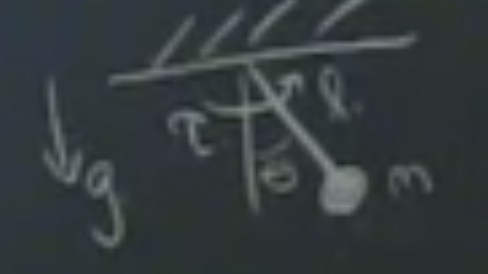
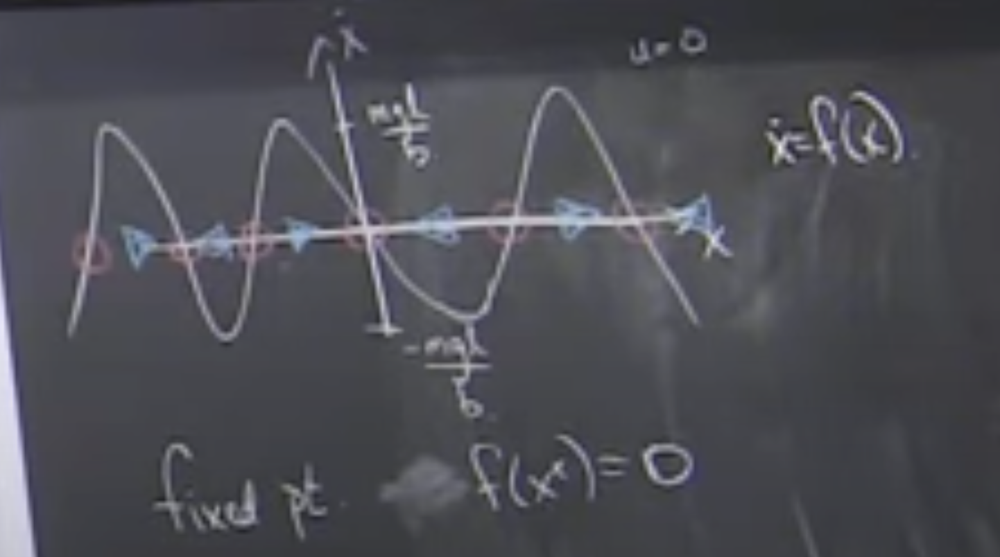
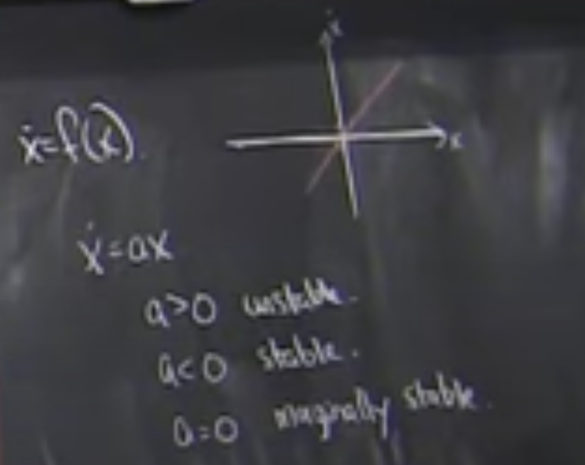
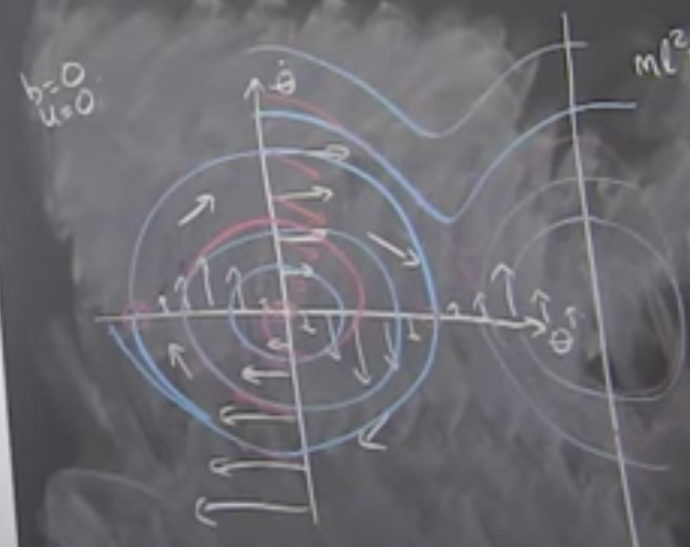

# Lecture 2 - Non-linear Dynamics

" Simple " Pendulum

Kinetic Energy = T

Potential Energy = U

Lagrangian: `L = T-U`

$T = \frac{1}{2}ml^2 \dot\theta$

$U = -mglcos(\theta)$

$\frac{d}{dt}\frac{L}{d\theta}-\frac{L}{d\theta}=Q$

Q is "generalized force"

$ml^2\ddot\theta+mglsin(\theta)= Q = -b\dot\theta+u$ 

Fit's general form: $M(\theta)\ddot\theta+C(\theta,\dot\theta) = \tau_g(\theta)+Bu$

ODE: given $\theta(0), \dot\theta(0)$ solve for $\theta(t)$

Linear ODE's have a closed form solution. Non-linear equations don't have a closed form solution in the general case. In this example it's specificaly because of the $sin(\theta)$

[8:00]
Change the question: "Where am I going to be at 32s" is a much harder question than "avoid tree? providly safe?"

Read "Nonlinear dynamics and chaos by Steven H. Strogatz"

Graphical Analysis
------------------
$b\dot\theta$ is the damping term

If we are in a large damping resiem (think $b>>ml^2$ but this doesn't make sense because they are different units), the system acts like first order.

Natural Frequency: $\sqrt{\frac{g}{l}} = \sqrt{\frac{m/s^2}{m}} = \frac{1}{s}$

Same units: 

$b\sqrt{\frac{l}{g}}>>ml^2$ (i.e. $\frac{kgm^2}{s}s>>kgm^2$)

- Over damping reshime is similar to "low reynolds number" in fluid dynamics. Viscous effects dominate over inertia effects.

In this region, the equation simplifies to:

$b\dot\theta+mglsin(\theta)=u$ 

This is a simple non-linear function:
$\dot{x}=f(x,u)$

Step 1: Draw the function $f$

Fixed point: $f(x^*)=0$

If $\dot{x} < 0 $ it converges to the left Fixed Point.
If $\dot{x} > 0 $ it converges to the right Fixed Point.

Stable Fixed point has two arrows pointing together.
Unstable Fixed Point has two arrows pointing away.

Linear functions are a simple line. Has to pass through origin.

[28:00]
Definition of Stability

A fixed point $x^*$ is locally stable "in the sense of Lyapnov" (isL) for every $\epsilon$ there exists a $\delta>0$ s.t. 

$||x(0)-x^2||<\delta$ for all $t$ $||x(t)-x^*||<\epsilon$

"Weak" notion of stability as it doesn't have to converge.

$x^*$ is locally asymptotically stable iff isL and $x(0)=x^*+\epsilon \to \lim_{t \to \infty} ||x(t)-x^*||=0$

Is locally exponentialy stable (getting there at a rate) iff $x(0)=x^*+\epsilon \to ||x(t)-x^*||=Ce^{\alpha t}$

[40:00]
The Autapse: Simplest Recursive Neuron in a NN

$\dot{x}=-x+tanh(\omega x)$

if w=1, single fixed point.
if w=10, two fixed points with an unstable point inbetween (bistability, switch, latch, etc.)

vs JANET (Just Another Net, simplified LSTM) vs LSTM (Long-Short Term Memory)

[1:06:00]
Bifurcation Diagram

[1:09:00]
Double Pendulum

$ml^2\ddot\theta+b\dot\theta+mglsin(\theta)=u$

$\dot{x}=f(x,u)$

$x = [\theta,\dot\theta]'$

$\dot{x} = [\dot\theta,\ddot\theta]'$

Plotting $x$ vs $\dot{x}$ results in the "Phase Diagram"

