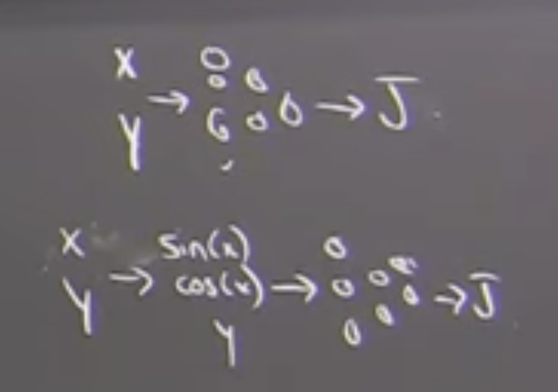

# Dynamic Programming III

Fitted Value Iteration

- Last time LQR on linearized system
- Later, cover "a better way" to do LQR optimal control if you acknowledge there are some linear terms that are missing. Use tools from robust control to say the system is linear +- some delta, tell lqr about the delta to get a bigger basin of atraction

Q: How far can we get with value iteration?

So far, we discretized:

## Pendulum

$q$ in 51 $\dot{q}$ in 51

51x51 mesh 
- odd size because you want to include the origin
- Cost-to-go is zero at the origin
- If you don't have a place with zero cost, then infinet horizen cost is unbounded where cost stops accruing.

## Acrobot

$51^4$ numbers grow fast for discrete value iteration

Other issues: 51 points shouldn't be equaly spaced. Need more resolution near the top point. 

## Quadrotor 

$51^{12}$ or $51^{13}$

## Value Iteration with function approximation
Represent $\hat{J}_\alpha(x)$ with a neural network w/ parameters $\alpha$ (weights and bias)

What is the value iteration update for $\alpha$?

Discrete

$\hat{J}(s_i)=min_a[l(s,a)+\hat{J}(f(s,a))]$

$s[n+1]=f(s[n],a[n])$

$\Sigma_{n=0}^\infty l(s[n],a[n])$

Would love something like for all x,

$\hat{J}(x)=min_a[l(x,u)+\hat{J}(f(x,u))]$

However, can't do this for all posible x. Instead, take a bunch of sample points $x_i$ (maybe 5000 samples in space)

Here we have a finite number of parameters so we can only *approximate* the function $\hat{J}(x)$. 

At all sample points, compute "desired cost to go" $\hat{J}^d(x)$ based on current estimate of parameters $\alpha$

$\hat{J}^d(x_i)=min_a[l(x_i,u)+\hat{J}_\alpha(f(x_i,u))]$

Given desired cost to go that we'd love the network to have, write a small supervised learning problem to do that. Minimize a non-linear least-squared error problem.

$\min_\alpha \Sigma_i [\hat{J}_\alpha(x_i)-\hat{J}^d(x_i)]^2$

(i.e. set the available parameters as close as posible to the desired values)

[18:30]
Why create a desired loss function as a first step and then solve the optimization problem? Because the first aproach is not the same as directly solving the optimization problem:

$\min_\alpha \Sigma_i [\hat{J}_\alpha(x_i)-\min_a[l(s,a)+\hat{J}_\alpha(f(x_i,a))] ]^2$

In the above optimizaiton problem, $\alpha$ enters in both min problems. One step of gradient decent changes both values. This doesn't work in practice. Most theory is build around the idea of 1) keep $\alpha$ fixed and write it to a constant value $\hat{J}^d(x_i)$ and 2) then minimize the objective. 

For more info, look into: 
- Target Network approach
- Two time-scale algorithms

Substantial practical and theoretical justification for why only take gradient of $\alpha$ on left side and freeze the $\alpha$ on the right side. Analysing the performance of these algorithms is harder than just pure superfised learning. 

It's supervised learning with a moving target. Two dynamics: Desired Cost to go moving, and converging on the non-linear function approximation loss. Those dynamics have to get along for the algorithm to do well.

[21:30] Besides that small caviot, simply run through the crank of supervised learning. Simply minimize the non-linear least squares using favorite gradient decent algorithm (i.e. Adam). If there are a lot of points, concider taking a subset and doing a mini-batch update.

## Very important special case - Linear function approximaters

Seperates challenges of non-linear least squres from the challenges of what happens with approximation in a value iteration loop. We can turn this into a linear-least squares problem with the function approximator is a linear function approximator. Sounds limiting but is a very rich class (not as rich as a DNN).

$\hat{J}_\alpha(x)=\alpha^T\Phi(x) = \Sigma_i\alpha_i\Phi_i(x)$

Function is a linear combination of potentially non-linear features.

- Radial basis functions
- Barycentric Functions
- Support vector machines (SVM)
    - Linear functions in a kernal space can be very rich
- Ultra-wide Neural Nets
    - NTK - Neural Tangent Kernal
    - Some people argue in the theory of ML that the way to think about a super huge NN especially in the limit when the second to last layer is "Ultra-Wide" is that the NN is creating many random non-linear features and then linear network at the end weighting and merging them. One reason why overtraining can get you to zero training error.
    - Not what's happening in practice

$\min_\alpha \Sigma_i[\alpha^T\Phi_i(x_i)-J^d(x_i)]^2$

linear-least squares can be solved via closed form instead of with gradient decent.

This is big because if we can take the second step (solving non-linear least squares via gradient decent) and solve to global optimality, then we can remove that part of the dynamics and focus just on how alpha updates the value iteration of the desired cost to go. Linear function approximators are a very special case.

Fist studied in discrete / tabular setting. (i.e very very large vector can be aproximated by a little vector).

$\hat{J}_\alpha(s_i)=\alpha^T\Phi(s_i)$

For example, map $51^4$ -> $1000$

Tsitsiklis + Van Roy '97
Showed in this discrete, function approximation with value iteration setting, $\alpha$ -> $\alpha^*$ i.e. $\hat{J}_\alpha(s_i)\approx \hat{J}^*(s_i)$ with probability 1

## [36:00] LQR via fitted value iteration

$\hat{J}_S(x) = x^TSx = \Sigma_i s_ix_i^2$

Quadratic in x, linear in S 
- This is a valid linear function approximator
- Value iteration on S
- Linear function approx.

See code example
- Compute LQR
- Ensure Fitted Value Iteration converges to S from LQR solution

Initial example blows up:
- Watch out for discretized actions u not getting exactly to the origin (i.e. 0 state)
- If there's no way to get to 0 cost, cost will increase to inf

## [45:00] Discounting
$0\leq\gamma\leq1$

Discounted Cost Function: $\min_{a[*]}\Sigma_{n=0}^\infty \gamma^nl(s_i,u_i)$

- All over in RL
- Discounting would fix the issue of no discrete u getting to the goal for value iteration.
- Can solve "Discounted LQR" in closed form 
    - Has an Algebraic Ricatti Equation
    - DARE($\sqrt{\gamma} A,B,Q, 1/\gamma R$)
- Gives different controller

Discounting gives the effect of "taking my dynamics and pretending they are more stable than they actually are"

Discounting: Pretending the world is simpler than it actually is.

- Very disatisfying. There's a known closed form solution. 
- If you have to discount, something seems inadiquite.
- Could find a discounted controller that's unstable on the system you're trying to control.

## [51:00] Better solution than discounting

Don't use sampled u, use the LQR controller.

C.T. $u^*=-K^*x=-R^{-1}B^TS^*x$

Proposal, $u=-\hat{K}x=-R^{-1}B^T\hat{S}x$

## [57:00] Another Subtlety

C.T. Ricattii equation

$0 = Q-SBR^{-1}B^TS+SA^T+A^TS$

Quadratic Equation in S

Optimal solution is the "unique positive-definite solution"

Example

$\dot q = u$

$l(x,u) = q^2 + u^2$

$A = 0, B = 1, Q = 1, R = 1$

$0 = 1 - s^2$

$s = \pm 1$

We told Ricattii equation solver to do this. We haven't told value iteration to do this.

On a discrete graph, you can't run off to infinitiy. In the limit (if you had a huge graph), value iteration can converge to an unstable controller.
Most work assumes you're starting from an initial controller that's at least stabalizing and not going to blow up. Then, you're normally in a good place where the gradient is correct and you should land on a stable controller. Guarentee in continuous time are subtle.

## [1:05:00] Neural Fitted Value Iteration

Function approximator that has a lot more generalization power.

$\hat{J}_\alpha(x)$ neural net

- In control, people use pretty small nerual networks.
    - Relatively simple multi-layer perceptrons (MLP)
- There are *some* deep RL (like alpha-GO)

D.T. $J^d (x_i) = \min_u [ l(x_i,u) + \hat{J}_\alpha (f(x_i,u))] $

- sampling u can run into problems.
- even if cost function $l(x,u)$ is convex in $u$, $\hat{J}_\alpha$ isn't
- solving the $\min_u$ looks harder in value iteration
- in practice, a lot of people use actor-critic to get around this problem.
- shouldn't have to do that here because of trick from before.

C.T. $J^d (x_i) = \min_u [ l(x,u) + \frac{\partial \hat{J}_\alpha}{\partial x} f(x_i,u)] $

if cost function $l(x,u)$ is convex in $u$ and $f(x,u)$ is control-afine. Even if I have a neural-network, can I solve in closed form? Yes, even though $J(x)$ is a huge network, we're just taking the derivative of the neural network and multiplying it by the dynamics. Can still solve for the $\min_u$ in closed form. Get $\frac{\partial \hat{J}_\alpha}{\partial x}$ from backprop algorithm.

Summary: Somewhere, there has to be a discretized approximation of the continuous dynamics. Recommended after solving for $u^*$ instead of before.

$J^d (x_i) = l(x,u^*)dt + \hat{J}_\alpha(x_i+ f(x_i,u)dt] $

Then it fits back into supervised learning

$\min_\alpha \Sigma_i [\hat{J}_\alpha(x_i)-J^d(x_i)]^2$

Good unit tests, check that it does the right thing on the 
- double integrator
- pendulum
- acrobot

See code examples
- Implementation details
- weight initialization matters
    - pytorch picks default weights / alphas. If you pick bad ones, things go badly
    - Adam really helps (over simple gradient decent)
        - scalling
        - momentum
    - mini-batch helps in big problems
    - wrap-arround network (if dynamics call for it)
        - 0 and $2\pi$ should mean the same thing to the network
        - 