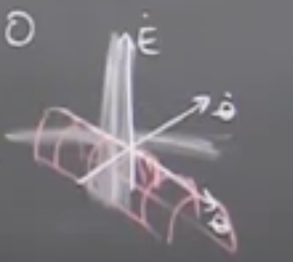

# Lecture 7 - Lyapnov Analysis I

Today:
- Non-linear stability analysis
- Lots of examples
- Energy whipping

So far:
- Optimal control
- Dynamic programming

Last time:
- Approximate DP w/ function approx

Today:
- Sufficient conditions ask far less than full optimality

"Accomplish the task" is often formulated w/ tools from stability analysis

## Stability of the damped pendulum

$ml^2\ddot{\theta}+b\dot{\theta}-mgl\sin(\theta)=0$

We would like to talk about long term dynamics however we don't know how to integrate the equations of motion. Can't solve explicitly for $\theta(t)$ for this differential equation.

Energy argument for stability of $x^*=[0;0]$

$E = \frac{1}{2}ml^2\dot{\theta}^2 - mgl\cos(\theta) \geq -mgl$

$\frac{d}{dt}E = ml^2\ddot{\theta}\dot{\theta} + \dot{\theta}mgl\sin(\theta) = (-b\dot{\theta}+mgl\sin(\theta))\dot\theta-\dot\theta mgl\sin(\theta) = -b\dot\theta^2 \leq 0$

$\dot{E}$ is negative definite "trough"

## [12:00] Lyapnov functions
Generalize notion of energy function: Lyapnov functions / analysis

Given $\dot{x} = f(x)$

- for now limited to passive or closed loop systems (no u)

Goal is to analyze stability of fixed-point $x^* = 0$

If I can produce a differentiable function

positive definite function
- $\forall{x\neq0},  V(x) > 0, V(0)=0$
- i.e. $V(x)\succ 0$

negative semi-definite function
- $\forall{x\neq0},  \dot{V}(x) \leq 0, \dot{V}(0)=0$
- i.e. $\dot{V}(x)\preceq 0$

then $x^*=0$ is stable in the sense of lyapnov i.s.L

...

More info about categorizing stability.

## [35:00] Examples

## [42:00] Regional Stability

Types of stability
- Local
- Regional
- Global

## [55:00] LaSalle's Theorem

- Invariant sets
- Relationship to HJB

## [1:05:00] Energy swing up
- homoclinic orbit vs heteroclinic orbit
- defined by states that have $E(x)=mgl$
- controller derived from lyapnov is super robust. Energy based controller
