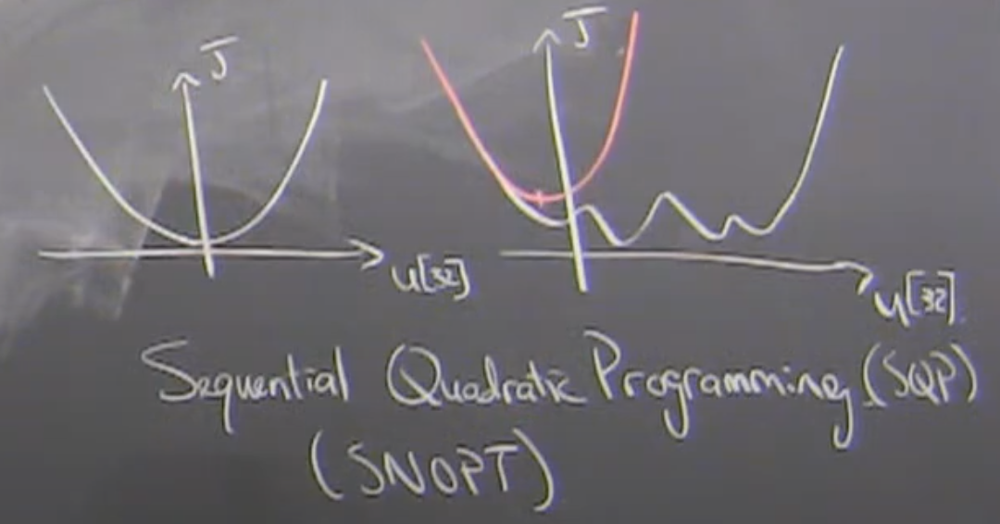
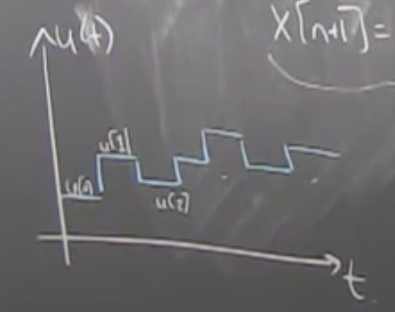
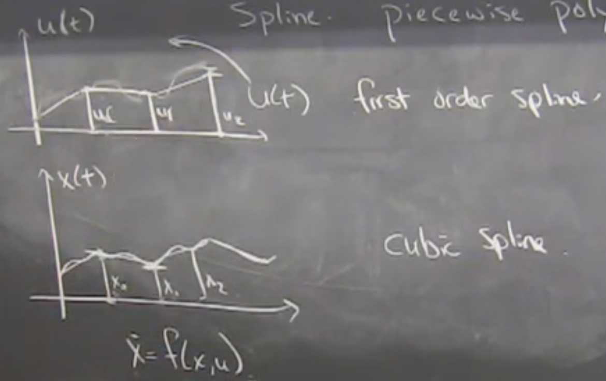

# Lecture 11 - Trajectory Optimization

## Themes of Class
    
    We should be doing optimization to solve the problems but the dynamics should matter. Optimizing a dynamic system isn't the same as general optimization because we know more about it. There's "structure in the equations" that we should exploit. Should make optimization scale, require less compute, be more reliable, ect.

## High Level Review

Dynamic Programming 
- Value Iteration
    - Discritized meshes good for small systems 
        - hasn't changed in 20 years
        - ~5 state variables
        - exponentially expensive
    - Neural approaches can extend but with fewer guarentees
- LQR (special case)
    - Arbitrary high dimensions
    - Requires linearization of dynamics
Lyaponov (relaxed optimal definition)
- Sums of Squares
    - Why SoS? Equation of motion shows up in optimization in a deep, integrated way.

**All of these methods are trying to solve for all x (full state space)**
- Very hard (maybe artifictially hard) problem
- Instead, could we solve for only the important and relative states

## Trajectory Optimization

Trajectory optimization is a direct attack against creating a controller that works for all states. Instead, we switch the problem to solve a smaller problem of "finding a controller that works for a particular `x[0]`". One trajectory that determines what the controll action should be for a finite amount of time.

    We try to handle very high demensional problems by solving a more narrow problem which scales only with parameterization in time, not state.

This is what Atlas uses at Boston Dynamics. It does scale and work in practice.

## [ 9:30 ] Story of "Bird Landing on Pirtch"

- Angle of Attack (deep stall)
- Birds have "Mad Stop"
- Controls problem or hardware problem?
- Dimensional Analysis (compare on fair scale)
- Experiment Design
- Dynamic Model
- Simulation

1. Take trajectory that's pre-computed
2. Stabalize trajectory (local LQR or ther means)
3. Lyaponav functions around trajectory that certifies a range of ic to range of fc
4. Repeat for multiple "funnels" of ic

## [29:00] Problem Definition

For some system $\dot{x} = f(x,u)$,

Find $u(.)$ control action that minimizes cost from $t_0$ to $t_f$ subject to system dyanmics, initial condition, and additional constraints (actuator limits, state limits, etc.).

$
min_{u(.)} \int_{t_0}^{t_f}l(x,u)dt \\
s.t.                                \\ 
\dot{x}=f(x,u)                      \\
x(0) = x_0                          \\
+additional constraints
$

Only difference from earlier problems is,
1. Given initial condition
2. Instead of searching for control policy, we're searching over an open loop trajectory $u(t)$

Note: if $f(x,u)$ has modeling erros and/or you predict far into the future, this is where feedback will save the day

## [35:00] Linear discrete-time case

Given dynamics, $x[n+1]=Ax[n]+Bu[n]$

$ \min_{u[.]}\sum_{n=0}^N{l(x[n],u[n])} $

Output would be,

$u[0],u[1],...,u[N[$

"Finite search" of `# control inputs`*`# timesetps`

### Direct Transcription (aka MPC)

Add $x[.]$ as extra discision variables,
$ \min_{u[.],x[.]}\sum_{n=0}^N{l(x[n],u[n])} \\
s.t.\\
x[n+1]=Ax[n]+Bu[n]\\
x[0] = x_0$

The dynamics are a "linear constraint on the decision variables".

If cost is a convex function, for example the LQR cost function $l(x[n],u[n]) = x[n]^TQ_xx[n]+u[n]^TR_uu[n]$, we can write a convex optimization with decision variables $u[.]$ and $x[.]$, linear constraints, and a quadratic objective

We had a good LQR solution previously but it wasn't through convex optimization. For all states, LQR wasn't a convex optimization problem but for one state in finite time, it is because cost is convext and constraints are convex.

Can also add additional constraints, for instance torque limits, state-limits, etc.

Compared to LQR, the differences are:
1. Narrow solution (only one initial condition)
2. With reliable solver, it'll scale to very large systems
3. Directly handle constraints. 99% of control theorists would say this is the "right way" to do constrained LQR.
4. Can solve "on the fly" because solvers have become so reliable and fast. Started in chemical industry with slow dynamics. Now it can run at fast rates like in Atlas. Even if $x$ is large and $N$ is large, if dynamics are linear, convex solvers will scale very well. 
5. $u[0]$ is going to effect the outcome more than $u[N]$(probably why people use smaller horizons for $u[k]$ than for $x[k]$)
 
### Direct Shooting (also MPC)

If paying attention to "adding $x[.]$ as a desicion variable", one might think "I shouldn't have to do that. It seems pretty waistful. We know how to multiply the differential equations. If I've solved for $u[k]$ I can compute $x[k]$ by simulating"

$ \min_{u[.]} \sum{x[n]^TQ_xx[n]+u[n]^TR_uu[n]}$

$
x[0] = x_0 \\
x[1] = Ax[0]+Bu[0]\\
x[2] = A^2x[0]+Ax[1]+Bu[0]\\
\dots\\
x[N] = A^Nx[0]+\dots+u[1]+u[2]
$

Entire problem can be only a function of $u[k]$ by pre-solving away $x[k]$. Substitue in "rolled out dynamics" in original cost function, drop the dynamics constraint because it's solved explicitly, which results in an optimization with fewer constraints directly on $u[.]$ (aka less decision variables).

This results in less decision variables but they are harder numerically to deal with.

## Discussion Comparing Direct Transcription and Direct Shooting
~50/50 Believing in `Direct Transcription` vs `Direct Shooting`

`Direct Shooting` isn't obviously better because,
1. $A^N$ results in numbers up to large powers
    - vanishing gradient problems in deep networks
    - exploding gradient problems
    - numerically less stable
    - Kirk's Question: Can't $A^N$ be solved cheaply and accurately using `Cayley-Hamilton Theorem`? Does that theorem have numerical issues? 
2. "Tail wagging the dog" imbalance issue
    - $u[0]$ has a much larger impact than $u[N]$. Much larger time to effect the system. Scaling is potentially challenging for solvers. $u[0]$ becomes very sensitive. `Direct Transcription` "spreads out" the numerical dificulties accross lots of constraints.
3. Therefore, `Direct Transcription` typically has better numerical properties.
4. When dynamics are hard to evaluate, you can trivially parallelize `Direct Transcription` where `Direct Shooting` has to be rolled out all the way. For example, 1000 rollouts in parallel on a GPU, this difference is less important than it used to be.

In the linear, convex optimization case, solvers are so good that you can do either and they are fine. There's really not a big difference between `Direct Transcription` and `Direct Shooting`. When you get to the non-linear versions, the solvers start to have more problems and the differences become more accute.

Note on Explicit MPC: Instead of $u=Kx$, we find $u[0],u[1]...$ assuming $x[0]=x_0$. You can explicity compute the policy for constrained LQR but it scales badly. The optimal policy becomes a peicewise linear function with a potentially exponencial number of pieces in the number of constraints. Value function is a piecewise quadratic function.

## [51:00] Non-Linear extension

Regardless if you use `Direct Transcription`: $x[n+1] = f(x[n],u[n])$ as a constraint or `Direct Shooting`: $x[n] = f(f(f(\dots)))$ in objective, the problem becomes non-linear and non-convex.

Solver has to be very different and prepared for very complex cost functions

## Various Types of solvers

Sequential Quadratic Programming (SQP)
- SNOPT: Sparse Non-Linear Optimization

We're good at solving QPs, even constrained QPs. Given a non-linear objective or constraints, a reasonable approach is to make a local quadratic approximation, solve to optimality, repeat.

Can result in very fast convergence to local minima for very hard non-linear problems.

Alternative solvers: 
1. `SNOPT`: Sparse Non-Linear Optimization
2. `IPOPT`: Internal-Point Optimization
3. `NLOPT`: Non-Linear Optimization

Nowadays, where $f(x[n],u[n])$ is a neural network, they tend to not use a second order optimization and instead do Genetic Algorithms (throw a bunch of particles into the system to make an approximation and repeat) because it's efficient to do on a GPU. Simply other methods for solving same class of non-linear problem.
1. `CEM`: Cross-Entropy Method
2. `MPPI`: Multi-Parameteric Path Integrals

## [57:00] Continuous Time

IMO, not as useful.

### Direct Transcription

Approximate with numerical integration:

$x[n+1] = \int_{t_n}^{t_{n+1}}f(x,u)dt+x[n]$

For example, Euler Integration:

$x[n+1] = x[n] +dt*f(x[n],u[n])$ 

Could also use RK4, etc. Don't recommend variable step step solver because it can mess with the QP solver. QP solver likes to have consistent steps. 

Only works with "causal" integration (forward in time). Explicit integration.

$u[n]$ ends up being a ZOH which can lead to artifacts in continuous time solution when using discrete time inputs. Similar to minimum time problem with discrete inputs. Wouldn't exactly get to goal exactly and would move the desicion boundary significantly.

### [1:04:30] Direct Colocation

Natively Continuous Time (doesn't make sense in discrete time)

Parameterize $u(t)$ and $x(t)$ as a spline (piecewise polynomial). 

"Sweet spot" is if $u(t)$ is a first order spline (aka FOH) and $x(t)$ is a third order spline. Similar to RK45 where terms cancel out and give exceptionaly good acuracy with lower computation. 3rd order acuracy with a handful of points.

Decision variables 

$
u[0],\dots,u[n]\\
x[0],\dots,x[n]
$

are at the breaks of the spline.

$u[0]$ and $u[1]$ completely specifies actuator first order spline (FOH)

Four desicion variables ($u[0]$, $u[1]$, $x[0]$, $x[1]$) and derivative constraint $\dot{x}=f(x,u)$ completely specifices the cubic spline. We make the derivative at the midpoint of $x(t)$) called the "Colocation point" satisfy the dynamics for that spline's final degree of freedom.

Acausal implicit integration. Higher order accuracy because using future information and solving for entire curve at the same time via constraints

## [1:12:00] Examples

- Acrobot
- Cart Pole
- Autonomous Driving
- Atlas Humanoid Robot