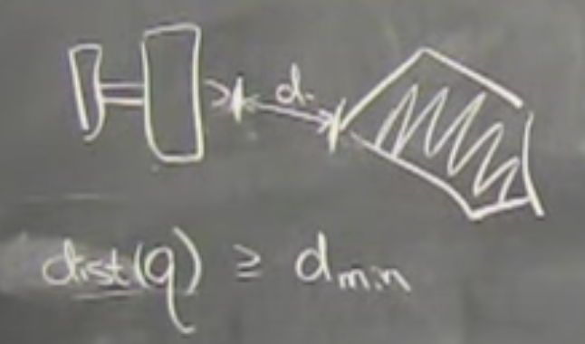
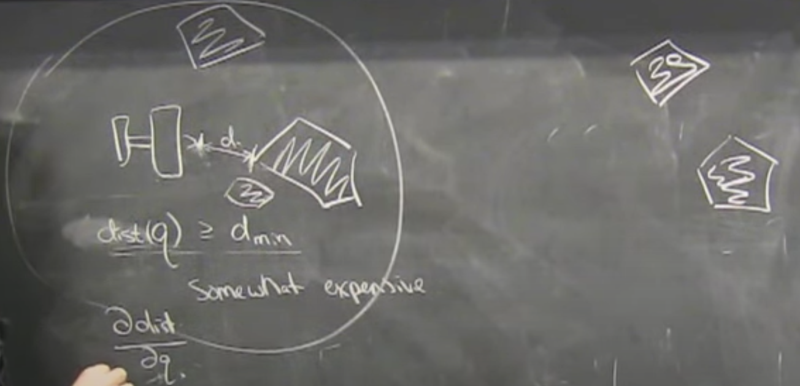

# Lecture 12: Trajectory Stabilization

This lecture is not actually Tragjectory Stabilization. It's more about Gradient Calculations. Last secion introduces MPC as "Trajectory Stabilization"

## Trajectory Optimization Review

One solution over time instead of "for all states". That's how trajectory optimizatino beats the curse of dimensinoality.

Two transcriptions:
- Direct Transcription
- Direct Shooting

Note on Optimality: If you don't include all states, it's hard to guarentee you're globably optimal. You haven't thought about all possible states. You can guarentee small changes to that trajectory would only be worse (locally optimal) but you can't guarentee there wasn't something else you didn't think about that would've been better.
- Kirk's question: As $N\rightarrow\infty$ for linear case, does the local optimal assumption in a "finite time" optimization become much more likely to be similar to a global optimal solution of a "infinite time" optimization?

## [16:00] Drake Solver Interface

- Black Box Solvers ("Zero Order")
    - Just give cost function
    - Often used in Reinforcement Learning
- Gradient Based Solvers ("First Order")
    - Give deriavative
- SQP ("Second Order")
    - SNOPT

Solvers use "Automatic Differenciation" (autodiff)
- Works okay for smaller, simple systems
- Once you get to Atlas, probably not good enough.

## [24:30] Taking Gradients Efficiently

`Direct Transcription`
- Gradients are fairly simple $\frac{\partial{l}}{\partial{x}}$, $\frac{\partial{l}}{\partial{u}}$, $\frac{\partial{f}}{\partial{x}}$, and $\frac{\partial{f}}{\partial{x}}$
- Gradients are "sparce" in the decision variables (cost at time `n` is independant of all other times)

`Direct Shooting`
- Gradients are "dense" in the decision variable (cost at time `n` depends on all other times)
- Computing gradient requires more careful methods
- Still very structured
- Can use chain rule efficiently, recursive use of computed gradients
- Looks very similar to Neural Network.
- Chain rule is the exact same as "back propogation" in neural nets.
- Optimal control did this first before backpropogation in neural nets (usually called "adjoint equations")
- Backpropogation is a specialized form for neural nets.
- One of the methods for auto-diff

How about derivatives $\frac{\partial{f}}{\partial{x}}$, and $\frac{\partial{f}}{\partial{x}}$ if $f$ if it's complicated?

> You will probably use neural networks to represent $f$ in your life. That's a perfectly reasonable thing to do to try and learn a model of your very complicated dynamics (robot, system) in a neural network.

If $f$ is represented as a neural-net,the derivatives come direct out of backpropogation. You get them from PyTorch and you're good. 

In general, reverse-mode autodiff is more complicated to implement almost always but it pays off when the number of outputs is small compared to the number of inputs.

Reverse-mode is a good choice for optimal control and neural networks is the same reason: you're trying to take the gradient of a scalar cost with respect to a lot of parameters.

Go all the way to the end of a lot of computation, to get a scalar number then just back up the gradient of that scalar number with respect to your many parameters. Reverse-mode "wins" in neural-networks and optimal control.

However, if $f$ is the multibody equations:

$M(q)\ddot{q}+C(q,\dot{q})=\tau_g(q)+Bu$

$f$ takes in as many things as it puts out. Dimensionality doesn't imply reverse-mode is obviously better. $f$ is an N-dimensional state and outputs N-dimensional outputs.

Turns out you can do better than PyTouch does. Neither Forward or Reverse fully takes advantage of the multibody equations. There's structure that special codes can take advantage of. Similar to linearization around a fixed point. A lot of terms actually zero and you don't have to take the gradients. Both Forward and Reverse mode get caught up in that. Specialized gradients can make it much faster.
- Justin Corqentier & Tuan Koalen work

## [41:00] Collision Avoidance Constraints

Tell collision engine, I only care about collisions up to some distance threshold afterwhich the constrain fades away and is automatically satisfied.

"Hinge Loss"
- tapering collision penalty after a threshold
- keeping it differentiable
- keeping it scalable

Drake
- Has good implementation of "Minimum Distance Constraints"

## [59:00] Atlas Example

- Inverse Kinematics
- Joint positions
- All subject to constraints
    - end effector
    - joint limits
    - collision avoidance
    - "gaze constraints"
    - feet stay put
    - balance constraints
    - ...
- Solve with SQP
    - Commercial solver: SNOPT
    - Exploit kinematic chain sparsity
    - Around 100Hz (2015)
    - Returns locally optimal $q$ (and possibly "infeasible")

Big robot, little car
Kinematic trajectory planning

Optimize $q(t)$ spline coefficients
Add constraints through time (points in contact don't move)
- Solve with SQP
- Solves in seconds

Dynamic trajectory planning
- Aditional constraints $F=ma$
- For "smooth" dynamical systems, trajectory optimization still works well

> Tool of choice for continuous systems is direct co-location. Sparse in gradience like `Direct Transcription`

Alternative planning approaches:
- SLAM is a different path planning approach
    - Estimation instead of planning
- Sample based planning: Randomized motion planning, RRT, probabilistic road maps
    - Not dynamic constraints
        - Trajectory optimization's natrual dynamic constraints is always better than sampling based planners.

## [1:09:30] Limitations

We talked about Lyaponav, HJB, LQR, etc. It looks like these non-linear optimizers can do all that and more, why did we even talk about the eariler stuff?
- These are local methods and the concequences can be severe.
- Always a chance non-linear optimization can't find any trajectory even if one exists. Could get stuck without ability to satisfy any constraints, there is no solution. Error code.
- Not used as much.
- Boston Dyanmics and Autonomous Driving will often times, offline use trajectory optimization to compute a library of trajectories that they know are good and will use a more local LQR or guarenteed approach that will have to run in real-time.
- Fantastic for discovering things but may require hand tuning.
- Hard to rely on it working everytime.
- Can be very hard in robot's joint space. The problem looks easy but in practice, because of constraints, could be like threading a needle in configuration space. The local methods aren't complete. Possible it wouldn't find anything even when something exists.

## Making it reliable (Trajectory Stabilization)

Local planning vs global planning
- Same tools could be used for both

Global Planning (what's been reviewed):
- find path through trees s.t $\dot{x}=f(x,u)$

Given a nominal (desired) trajectory:
- $x^d[.],u^d[.]$
- $l(x[n],u[n]) =
(x[n]-x^d[n])^T Q_x (x[n]-x^d[n]) +
(u[n]-u^d[n])^T R_u (u[n]-u^d[n])
$

## [1:17:00] Extreme Case (Linear MPC)

If the dynamics are linear:

$f(x,u) = Ax+Bu$ 

and the cost function
$l(x,u)$ is Convex, Trajectory optimization is Convex Optimization and it is robust enough to run in real time in safety critical applications.

In the same way as we use linearization of non-linear system + LQR, there is a regime where  $f(x,u)$ is close enough to my nominal trajectory that I can lean on Convex Optimization.

Local
- Use the reliable convex optimization to stabalize a trajectory.

Global
- Trajectory is solved offline with non-convex optimization.

Not enough for it to be convex. If you want to use in an on-line fashion in order to reject model errors and disturbances,
1. Solve a trajectory optimization for $x[.]$ and $u[.]$
2. Execute $u[0]$
3. Let my dyanmics advance
4. Measure $x[1]$
5. Throw the rest away
6. Set $x_0=x[1]$
7. Repeat

There are a few very important ideas in MPC that can guarentee that if I found a solution on the previous step, that there will still be a solution at the next step. I won't sudenly get myself into a condition where the constraints won't be satisfied.
- "Recursive feasibility"