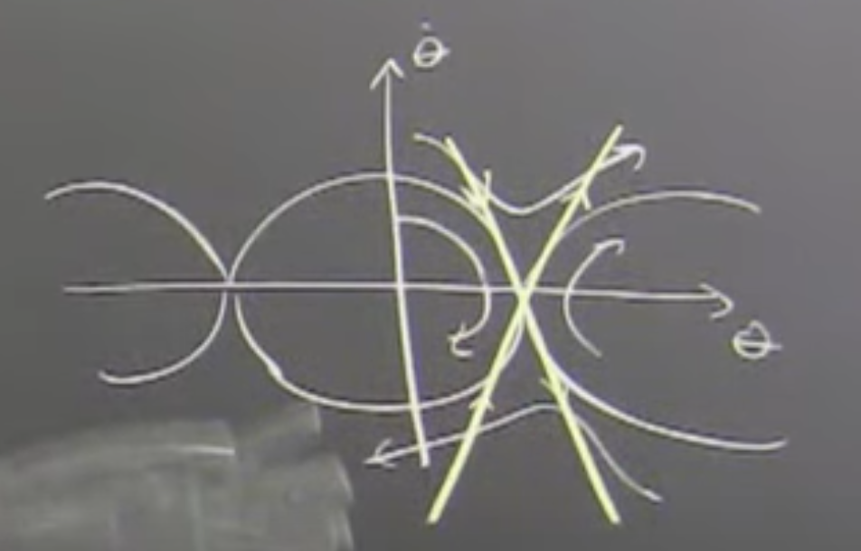
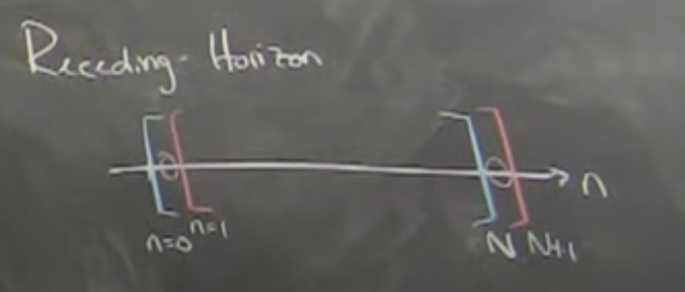

# Lecture 13: Trajectory Stabilization 2

## Open Loop Trajectory Playback

Pertching example where Trajectory Optimization was used to compute $x[.]$ and $u[.]$ over all time.

Then an open-loop simulation with exactly the same initial conditions using the $u[.]$ that was copmuted fails to pertch.

The Trajectory Optimization was a `Direct Colocation` example. Numerical erros creep due to differences in how the dynamics are imposed. `Direct Colocation` imposes dynamic constraints up to 3rd order at colocation point while the simulation uses some type of numerical integration at a point in time to then update the state. That slight difference (a different integration scheme) is enough to miss the perch completely.

Further,
- acrobot wouldn't get to the top

Instead, Russ shows the same Trajectory but using a `Finitie Horizon LQR` feedback controller

**Trajectory Optimization alone is not enough. Closed-loop feedback control is still necessary.**

> I just started as faculty and was like "The old guys do linear control and now we should do non-linear control and linear control is no good and non-linear control is the only thing." This is the project where I learned linear control is pretty darn good. I should stop saying that and I should use it as much as I can and try to push beyond it. I saw examples where the trajectory comes out very different than the nominal trajectory and the linear controller does an exceptional job of stabilizing it. It would take corrective manuvers. When there was too much velocity, it would go up into the air in order to slow down. The linearization is a very informative summary of the dynamics and the linear control can do non-trivial things over time to exploit that. At some point it's not good enough, that's definetly true but it's more powerful than I had originally given it credit for.

## Linearizingn About a Trajectory

Recall, linearizing about a fixed-point. The linear controller does very well around the fixed point and only gets bad once it has deviated too far.

What would it mean to linearize around not a fixed point?

Linearization machinery was just a taylor approximation. So,

$\dot{x} = f(x,u) \\
\dot{x}\approx f(x_0,u_0)+\frac{\partial{f}}{\partial{x}}\rvert_{x_0,u_0}(x-x_0)+\frac{\partial{f}}{\partial{u}}\rvert_{x_0,u_0}(u-u_0)$

$f(x_0,u_0)$ is only zero at a fixed point.

When you linearize around a non-fixed point, you don't get a linear system, you get an affine system.

$\dot{x} = Ax+Bu+C$

Stabilizing an affine system is not clearly stabilizable, you have to do a special trick to make LQR work here. The natrual solution is to instead of linearize around a point, linearize around a trajectory. This effectively creates a "moving coordinate system" along the trajectory. Effictivly becomes a time-varying system.

$\dot{x} \approx f(x_0(t),u_0(t)) + \frac{\partial{f}}{\partial{x}}\rvert_{x_0,u_0}(x-x_0(t))+\frac{\partial{f}}{\partial{u}}\rvert_{x_0,u_0}(u-u_0(t))$

If $x_0(t),u_0(t)$ is a feasible trajectory, that means it's consistent with the dynamics.

$\dot{x}_0(t)=f(x_0(t),u_0(t))$

The way things become linear and good again is to perform a change of variables and write the dynamics in the form of the error coordinates:

$\bar{x}=x-x_0(t)\\
\bar{u}=u-u_0(t)$

The one aditional feature is that the derivatives are evaluated at the linearization point so now it's time-varying $A(t), B(t)$

$\dot{\bar{x}}=A(t)\bar{x}+B(t)\bar{u}$

Now the system is linear (not affine). The interpretation is that it's a linearization in a moving coordinate system. The definition of the $\bar{x}$ reference frame is itself time-varying.

## [20:30] Finite Horizon LQR

Guess what? It turns out that a lot of the wealth of linear control and linear optimal control still applies even if $A$ and $B$ are time-varying.

> This was a big surprise to me when I first came across this. You can imaging putting pretty compilcated systems into that form if you just suck the time dependence into $A(t)$ and $B(t)$. It's pretty surprising still that linear control can help.

Problem:

$\min \int_0^{t_f}(x-x_0(t))^TQ(x-x_0(t))+ (u^TRu) dt\\
s.t.\\
\dot{\bar{x}}=A(t)\bar{x}+B(t)\bar{u}$

Cost to Go:

$J(x,t) = \bar{x}^TS(t)\bar{x}$

Controller is still linear:

$u(t)=u_0(t)-K(t)\bar{x}$

Previously, Ricati equation equaled zero. Now, it equals $\dot{S}$. This is called differential Ricati equation:

$-\dot{S}(t)=\dots$

## [34:00] Time-varying Lyaponav Function

Help me... I just want to understand how to get $K(t)$...

## [43:00] How can level sets expand and contract?

- Control authority
- Contours of cost-to-go
- Verification
- Generalization of "going downhill faster than level-set is growing/shrinking"
- All works with sums of squares
- Safety controllers at boundary of verified controllers.

## [1:00:00] Model Predicitive Control (MPC)

1. Trajectory Optimization to find $x^*[n]$ and $u^*[n]$
2. Execute $u^*[0]$, throw the rest away.
3. Let dynamics evolve.
4. Repeat

Potentially risky business in the full glory of Trajectory Optimization. But in the particular case of Linear MPC (even time-varying Linear MPC), convex cost, linear constraints I can solve reliably.

Is there a chance, a future step is infeasible?

## Recursive Feasibility

During receeding horizon optimization there is a potential hazard when adding a new step that the problem will become infeasible. 

Simplest recipe for recursive feasibility
- Add extra artifictial constraint that $x[N] = 0$

You can do much fancier things, but if you do the above, the total cost from optimization problem is a Lyaponov function.