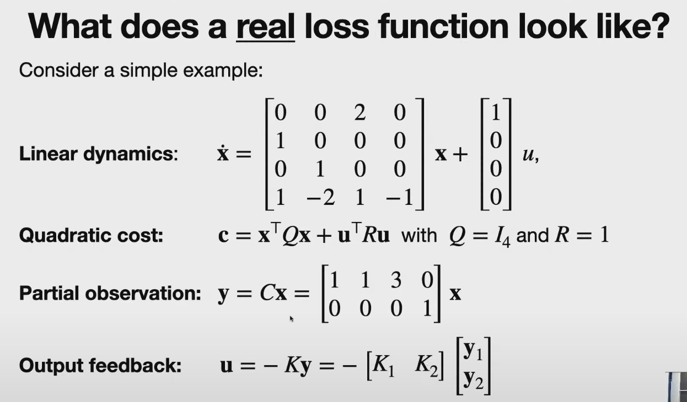
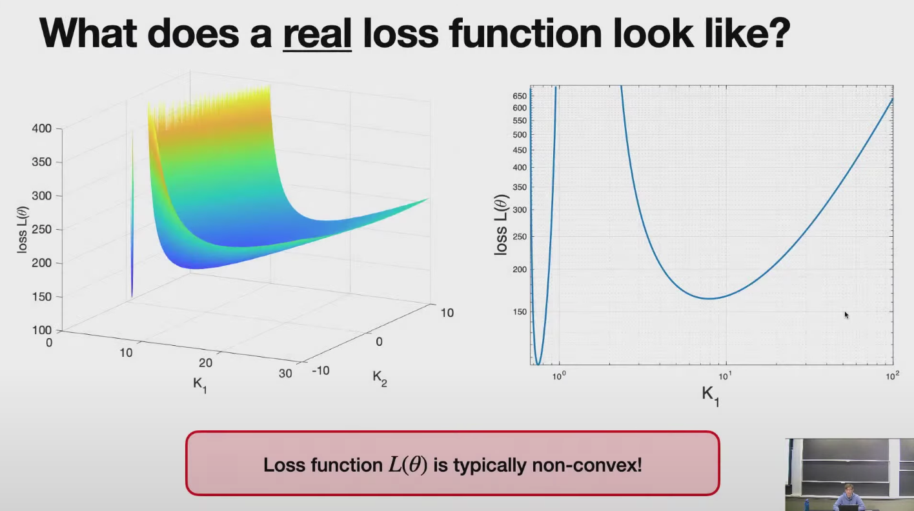
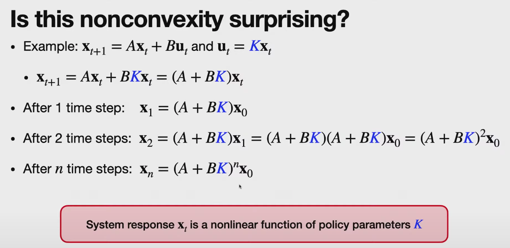
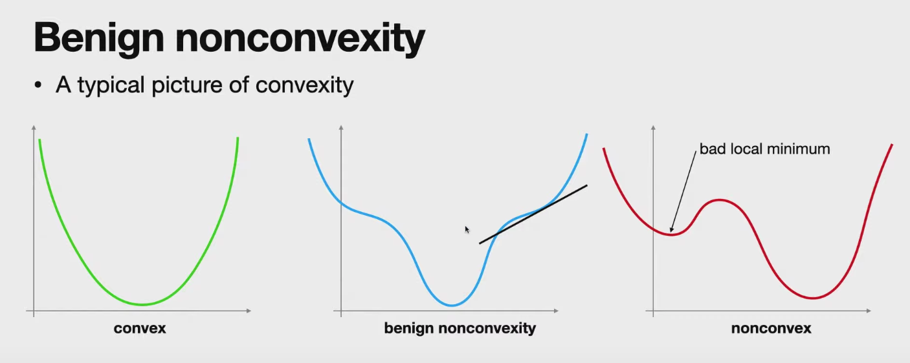
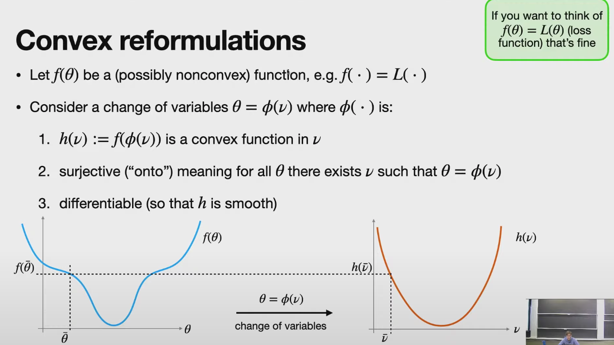
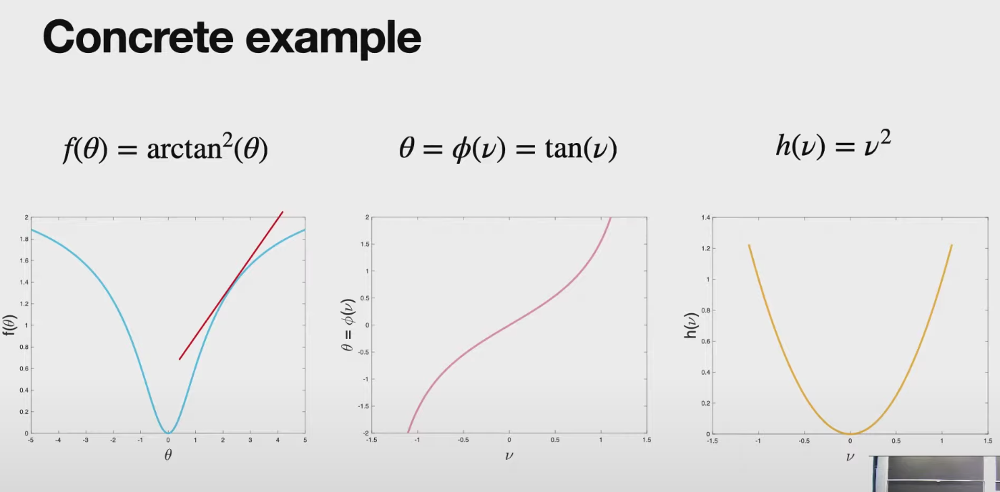

# Lecture 14: Direct Policy Search

OpenAI examples
- dexterity
- DOTA

In reasearch >10 years.
- roots go back to direct adaptive control done in the 70s
- Similar to reinforcement learning

Indirect vs. direct policy search
- Indirect: recover the policy from some other quantity.
- Direct: search/optimize directly in the space of policy parameters
- Indirect: is almost always model-based
- Direct: can be model-free or model-based. Only need to compute $L(\theta)$ and $\nabla L(\theta)$

Indirect policy search
1. model the system (e.g. 1st principles, learn from data, etc.)
2. solve some equation or optimizaiton problem (e.g. Bellman's equation or Riccati equation)
3. recover policy from the solution 

Direct Policy Search
1. Select a class of policies, e.g. linear feedback $\theta=K$
2. Loss of policy given by $L(\theta)=\int_{0}^{T}c(t)dt$
3. minimize $L(\theta)$ via gradient descent $\theta[k+1]=\theta[k]-\eta\nabla L(\theta)$

Why do direct policy search?
- Optimize for performance on the true system rather than an approximate model
    - Always a gap between model and true system. No model = no gap.
- Good policies can be simpler than predictive models
- Simple to implement and broadly applicable
    - no need to develop a complex model; Bellman equation can be hard to solve
    - just run gradient descent.

Downsides
- You many not have any guarantees for other systems
- Predictive models can be simpler than direct policy search.
- may not be effective, even for simple problems

What does a real loss function look like?
- Even for a linear system the cost can be non-convex.

Clearly a global and local minimum!

**System response $x_t$ is a nonlinear function of policy parameters K**

Why?

## [23:00] Benign Nonconvexity

LQR falls into Benign nonconvexity problem. Instead of partial state feedback, it requires full-state feedback

How can we determine what kind of nonconvexity we're dealing with?
- Analysis via convex reformulations

## [26:30] Convex Reformulations
1. After a change of variables, the new function is convex.
2. There must exist a 1:1 mapping of all variables into new space. (cannot go into a lower dimesion)
3. new mapping must remain differentiable

## [39:30] Gradient Dominance

The current value - minimum value is upper bounded by the abs(gradient)

Quasi-convexity
- sections of fully convex connect with non-fully convex parts

Strong Convexity
- entire function sits above another quadratic function.

## [1:08:00] Cost function of LQR

## [1:14:00] Nonconvexity of the LQR cost

## [1:17:00] Convex Reformulation of LQR

Don't need to use this reforulation. It's sufficient to know it exists. Then you can be confidenct gradient decent will converge to the global optimal.