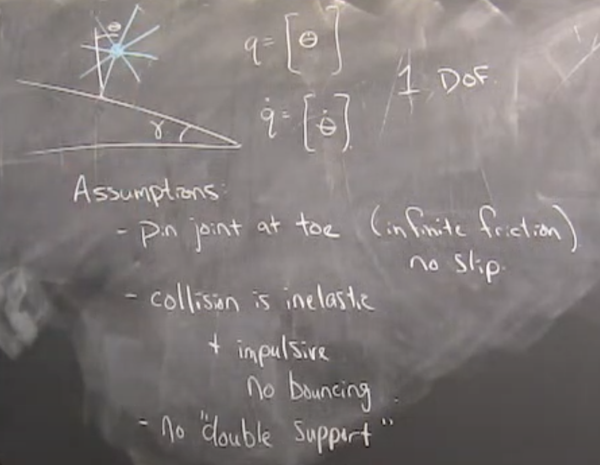
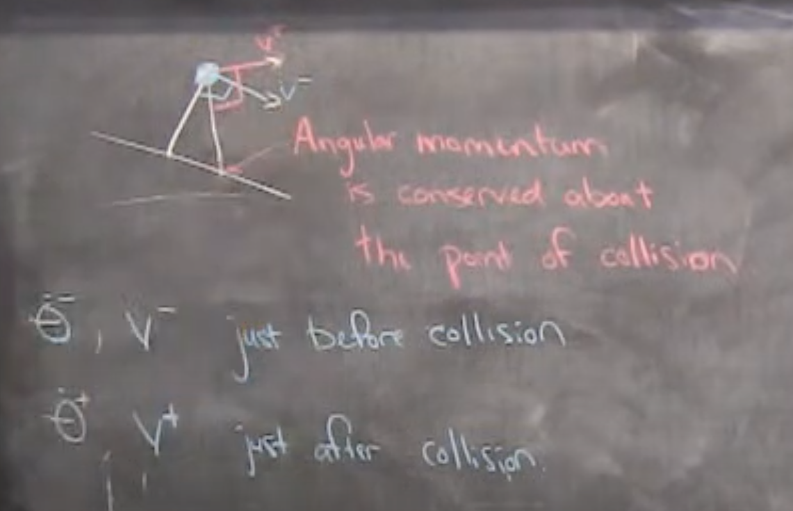
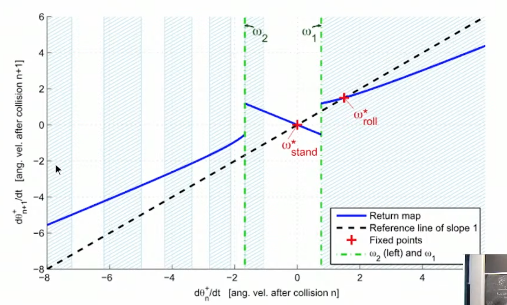
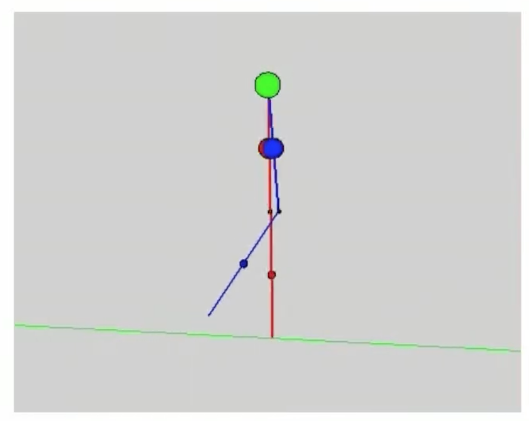

# Lecutre 15: Simple Models of Walking

## Examples and Motivation

Passive Dynamic Walkers
- Tad McGeer
- Steve Collins and Andy Ruina

## Today
1. Stability of a (limit) cycle.
2. Intro to contact / hybrid systems

## [6:00] Limit Cycle Stability

Van der Pol Oscilator
- $\ddot{q}=-q-(q^2-1)\dot{q}$
- has a "stable" limit cycle

Instead of defining stability as a fixed point, we define "Orbital Stability":

$min_\tau ||x(t)-x^*(\tau)|| \rarr0$

"Limit Cycle" is an orbitally stable periodic solution

Goal is to make everything still work.
- Linearize
- Take eigenvalues
- Lyaponov functions

Key Idea: Poincare Map
- Converts stability of a cycle -> stability of a fixed point.

Define a surface of section $S$. 
- if $x$ is in $\R^n$, $S$ is in $\R^{n-1}$

Write a new dynamical system which is the dynamics of the Poincare map.
- $x_p[n+1] = P(x_p[n])$

This is an iterative map with no connection to time. It may take more/less time per iteration. Time is abstracted away and it's purely a map from one crossing to the next crossing.

If there is a stable point, then the limit cycle that corresponds with it is stable.

## [27:00] Discrete Graphical Analysis

## [31:00] How do we model contact?

Many approaches:
- Spring damper models
    - When foot goes through ground, apply spring force to push it back out.
    - Spring needs to be stiff
    - Bad news for trajectory optimization because system becomes very "stiff"
- Hybrid Modeling w/ impulsive conditions.
    - Add new constraint
    - Re-wrtie dyanmics with a new equality constraint.
    - Results in single impulse with smooth dynamics before and after.

## [36:00] Rimless Wheel Example

1. Follow dynamics
2. Derive impulsive collision
3. Instantaneous change in coordinates
4. Lose some energy

## [45:00] How to derive impulse collision

Assumtion of an inellastic collision into an update of what happens to $\dot\theta$

In reset, you lose velocity but gain potential energy.

- After collision it should have zero velocity going into the ground.
- All energy going into the ground is lost.
- All other energy is conserved

At the moment of collision, Angular Momentum is concerved around the impact point.

1. Compute angular momentum just before contact ($Momentum = L\times(mv)$
2. Just after contact, new velocity is orthogonal to contact point. Magnitude is projection of old velocity onto new velocity. 

All energy around collision is concerved. All energy into collision is lost.
See notes:
 

## [1:00:00] Compass Gait Robot

1. Pin joint at hip
2. Legs have mass now.

Pushing off the ground can be extremely energy efficient

