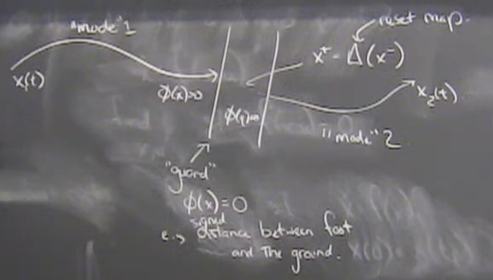

# Lecture 16: Hybrid Trajectory Optimization

Hybrid dynamics of contact:
- Model the dynamics in continuous time "modes" punctured by discrete events.
- favorable for trajecotry optimization 

## How do we find limit cycles

1. Simple systems can just be simulated for a long period of time.
2. Solve small optimization

## How do you find a fixed point?

$\dot{x}=f(x,u)$

Write an optimization problem:

$min_{x,u}\ g(x,u)\\
s.t. \\
f(x,u) = 0$

For limit cycles, do the same thing.

$min_{x,u}\ g(x,u)\\
s.t. \\
f(x,u) = 0 \\
x(0) = x(t_f)$

$x(0) = x(t_f)$ is the periodicity constraint

**Important point is that you really need to have the time as a decision variable.**
In order to simulate and find a solution, we don't know apriori what the duration of the trajectory is.

We need to allow the trajectory to stretch and shrink in time in order to solve the problem.

## [10:00] Find the Van der Pol Limit Cycle

## [17:00] Find the Rimless Wheel Limit Cycle

## [23:00] Examples

- Spring legs for running or hopping
- Why tracks are bouncy now. Measure people's CO2 when walking/running. Set the speed and see if they decide to walk or run. Can predict the walking to running transition point based on that curve.

## [29:30] General form for autonomous hybrid systems

Hybrid systems are sometimes used for systems like driving a car where you can decide to change gears.

> If the control system is allowed to design the change the events (aka shifting a transmission), it's a slightly different problem then if the world imposes the change upon the system.

1. Mode 1
2. Hybrid guard
3. Reset map.
4. Mode 2

$min_{x_1[.],x_2[.]} \int_0^{t_f}g(x,u)dt\\
\\
s.t.\\
\dot{x_1}=f_1(x_1,u)\\
\dot{x_2}=f_2(x_2,u)\\
\phi(x_1(t_c))=0\\
x_2(t_c^+)=\Delta(x_1(t_c^-))$

The above setup natrually falls into the above optimization form.

Time can still be a decision variable. The order (mode 1, collision, mode 2) is specified.

**This is a technology you can write science papers with**

The optimization almost falls away because it works so well. 

When the problem becomes harder (discover what mode I'm in as well as the trajecotries), we have codes that will do that but they're much less mature and will struggle to find solutions sometimes. More interesting problems but much less matrue.

## [41:00] Examples

Basketball "bounce pass"

## [47:00] Very Impressive
**Appendix B.3.2: Rigid Contact with Event Detection General Form** 

Given language of multi body equations and given the language of the guard, you can solve for the pre and post velocities and get closed form solutions

**Most simulators don't do this**

Russ only knows one simulation framework that has the option to simulate a rigid body dynamics with hybrid collision guards and resets. Efficiency of the events doesn't scale (think robot handling chalk. Most computation would be on collision events). Acuracy for numerics and simulation are fantastic if willing to use impulse collision models

## [1:06:00] Constrained Equations of Motion

Using contact forces instead of impulses