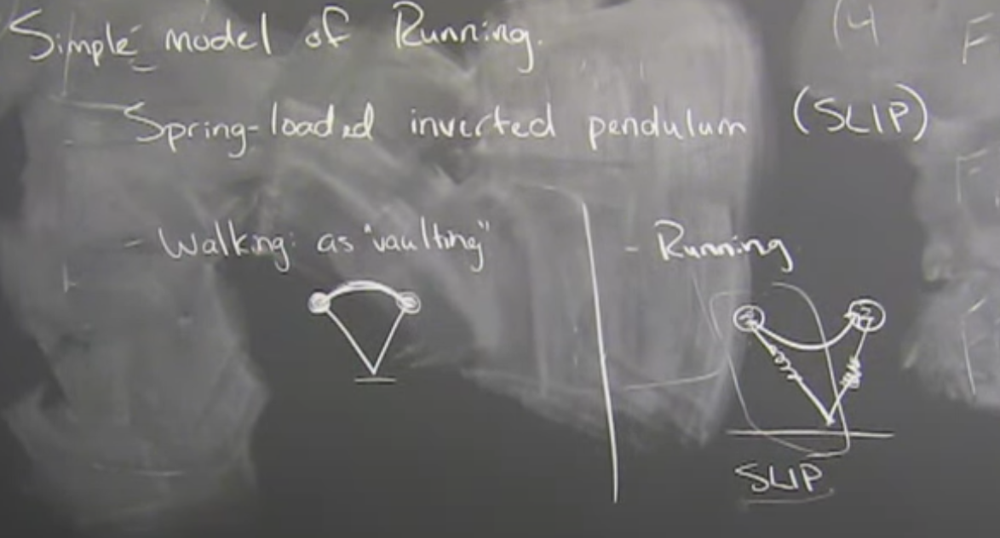
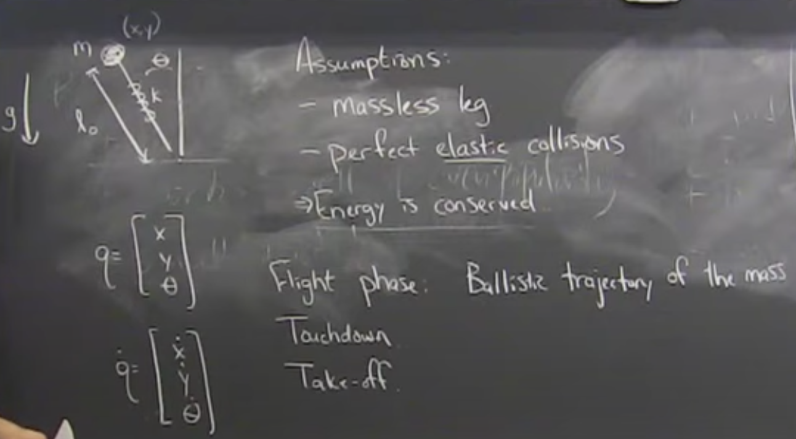

# Lecture 17: Hybrid Stabilization, Simple Running

How do you stabilize a (Hybrid) Limit Cycle?
- Stabilize the Poinere map
    - Ex. Spring loaded inverted pendulum (SLIP)
- Hybrid LQR
- Orbital stabilization
    - Transverse coordinates
    - Transverse LQR/Lyaponav

Walking as "vaulting" over "rimless wheel leg"

Running is fundamentaly different. Land, cener of mass goes down, jump back out.

Running robots started out as "hopping" robots. 
- Running happened first
- Good simple models for today.

## [8:00] SLIP Model

Control decision ($u$) is the touchdown angle of the leg. This is basically what Spot is doing.

Apex-to-Apex map

$y[n+1]=P(y[n],u[n])$

Goal: $u[n] = \pi(y[n])$

Approach #1 Linearize P and do discrete LQR.

## [32:00]

Approach #2 Deadbeat Control
- In a single discrete step, arives at the fixed point / goal.
- For any $x[0]$, choose $u[0]$ s.t. $P(x[0],u[0]) = x^d$
- Lets us continously "track" the angle to achieve the desired hight after a bounce regardless of terrain

**Open-loop, deadbeat, blind, running on rough terrain.**

> Control theorist never know how to abstract time. Lyaponav functions and Pontier maps are great ways to abstract time

Spring-mass model is pretty accurate with nature. Many things normalized for weight have basically the same characteristic stiffness.

## [44:00] Cockroach with a cannon

## [49:00] Applying LQR

## [57:00] Turns off a controller

Very interesting statement about transitiong through that imact region in a hybrid model.

> Controller could do the wrong thing right at the squirely moment of collision. This is a real problem. For many years and maybe still today, on mini cheeta, we would artificially turn the controll gains down to zero around the moment of impact. Dirty little secret in all our papers. Beautiful optimal controller and turn it off right before the foot hits the ground and imediately turn it back on because impact details. 

> With walking robots, the sign of the torque at the hip is exactly oposite if you're pre collision or post collision. Can cause absolute sign flip in the torque. The consequence of not dealing with it properly would be the robot throwing its leg away just before impact. "Slipping on a banana peel"

## [1:00:00] Moving Poincere Section

Transverse Coordinate system (doesn't have to be orthoganal but not parallel)

Change of basis:
- $x_1,x_2->r,\theta$

> The notion that there is a local asymptotic orbital stability sets of a cascade of results that becomes useful all the way up to control design.

Transverse linearization

$\dot{\theta}=f(\theta,\tau)\approx A(\tau)\theta$

Transverse LQR to estabilish orbital stability
- Time-varrying LQR in original coordinates would fight back against pertibations. Tries to stabalize phase and out of phase (coupled $r$ and $\theta$). 
- If you do LQR in the new coordinates and push it along the trajectory, it won't resist. This is a great solution to the instantaneous torque flip.

Pick a transverse coordinate system that lines up with the guard in the reset map such that worrying about what'll happen if I'm on the wrong side of the guard is gone. 

Almost the same as normal time-varying LQR but won't follow the ridgid time schedule and will just lookup where I am and use the closest time.
- If done after the fact, the small delay can get unstable solutions
- Transverse LQR is robust to that projection
- Don't design K in the full coordinates. Use only the transverse coordinates

## [1:21:00] Very cool video of robot that doesn't resist being pulled backwards because all it's doing is stabalizing around the limit cycle

[Video](https://youtu.be/t6ES_4y1Auc?t=33)

Easier on controller because you're stabalizing one less degree of freedom