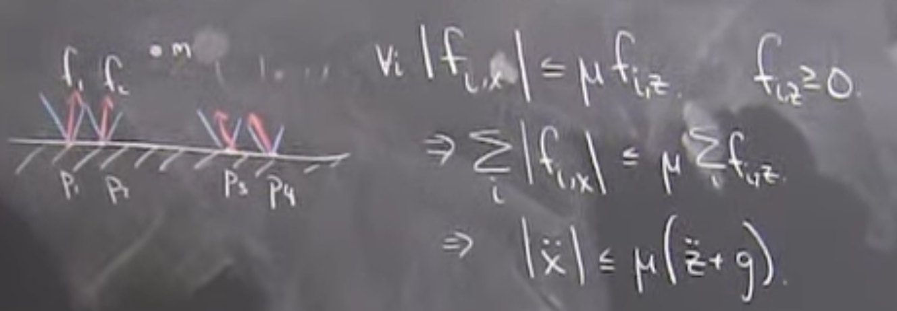

# Lecture 18: Humanoid Robots

[Very cool video](https://www.youtube.com/watch?v=zXbb6KQ0xV8)

Controller is a neural network
- Gains come from re enforcement learning (down played in this class because there are other classes that talk about it)
- Very fast simulator (1000x realtime). 
- Many many envoirments. 
- Trained the network only in simulation. 
- No extra training in reality.
- Model based
    - 1000x realimte
    - Domain randomization
    - Trained in sim, deployed in real world.

State of the field: Emperical success is very good but the guarentee is very weak

With some probablity you'll get an awesome result. Skill with this type of work increases probablity of success.

> I'm an optimist. I think we'll all be able to do it by understanding the fundamental equations. That's my path forward.

## [25:30] Once you get enough DOF, we can factor the optimal control problem into pieces

1. Control the center of mass (centroidal angular momentum) via contact forces
2. Move all of our joints to accomplish the CoM + contact trajectories.

Proposal:
1. Make a coarse plan of where am I going to put my feet and hands and what my center of mass is doing.
2. Filling in the details of how to move knees, arms, hips, etc. to achieve that plan.

> Atlas is 73 state variables (32+whatever)

> Kirk: My transmission's compliant model is 40 state variables (x9).

## [31:00] Create simple linear dynamic model assuming arbitrary actuators

1. I can move thrusters, but I have to turn them off to move them.
2. Only allowed to turn on thrusters in a few possible regions.

Problem becomes simple dynamics (even linear) but the hardness comes from "where do I put my actuators" and how to get between actuator regions.

"Jump" from one set of actuators to another.

> I think that's the right way to think about the centroidal dynamics of walking.

Constraints on forces (cones of friction before slipping, actuator limits) imply constraints on what the center of mass can do.

## [44:00]

How constraints on the forces imply constraints on the CoM dynamics.

Very important case on flat terain.

Friction cones

Magnitude of horizontal acceleration is bounded by my friction reltative to my acceleration with respect to gravity.

"Center of Pressure"
- Location on the ground where I can summarize my forces
- Same as center of mass
- Weighted sum of all forces

$\ddot{x}_{CoM}=-\frac{g}{h}(x_{CoP}-x_{CoM})$

Bounds on CoP imply bounds on CoM

CoP is always inside convex hull of contact points

Constrained LQR trajectories on center of mass. (in flat terain case)

## [57:00] Center of Mass planning w/ convex optimization.

ZMP = center of pressure

"Zero Moment Point (ZMP) Planning"
- I can't fall down unless my CoP is at the boundary of the support polygon.
- Simple trajectories of CoP lead to robust dynamic walking.
- Given desired CoP, solving for CoM is a (finite) LQR Problem.

## [1:13:00] Generalizations

Angular momentum terms. Centroidal Momentum Matrix.

Contact wrench code