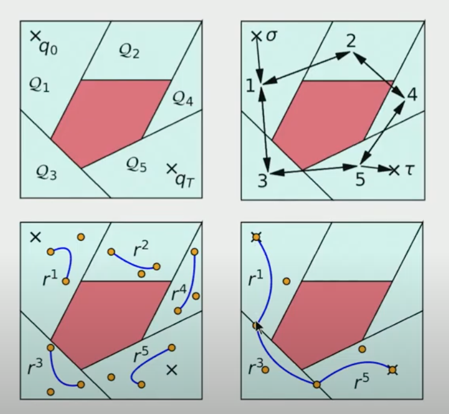

# Lecture 20: Motion Planning as Search

There are a lot of other tools out there inspired more by AI search instead of optimization. Sample based motion planning is 

2002 Thesis: Real-Time Motion Planning for Agile Autonomous Vehicles
- Help random planner by adding dynamic heuristics

> There has got to be a better way. Increadibly effective but very heuristic. Our current understanding of when they'll work isn't complete. Neuances that make one algorithm better or worse than another feels very heuristic.

## Motion Planning around Obstacles with Convex Optimization

Three Parts:
1. How do you make traj. opt. for the nonlinear dynamics look convex?
    - Differential Flatness
2. How do you make collision avoidance constraints convex?
    - Union over convex sets (mixed-integer formulations)
3. How do we make the combinatorial problem convex? (left or right around tree)
    - connect to convex combinatorial opt (shortest path on a graph)

## [10:00] Shortest Path Problem (SPP) on a Directed Graph

Loads of algorithms for these problems from CS
- Dykstra's
- A*

How to do it with convex optimization
- May not be the best for this specific problem (computation?) but will connect with harder problems

Here,
- Linear cost function.
- Linear equality constraint.
- Non-Linear integer constraint. 

Convex relaxation would "relax rho to be 0 or 1 to pho is between 0 and 1"

$\rho\in (0,1) \rarr \rho\in [0,1]$

Key Result: Convex relaxation is tight. It will still find optimal value with results of 0 or 1.

LP solver will always return integer feasible solution (even when fractional results are optimal). Entire face is equaly good. If rho >= 0, is enough.

Well known result means you can do graph search with convex optimization. Never would want to do it this way because of Dykstra's and A* but the same way you can use Semi-Definite programming to find a lyaponav function for a linear system, you'd never do it but it can help generalize the full lyaponav function.

## [30:00] Flying through a maze

Just finding a path through the maze, graph search would crush the problem. Once the problem becomes "Fly a UAV through the maze", the problem becomes NP hard in more than two dimensions. Very hard to find a continous curve.

## Graphs of convex sets

New Shortest path formulation

Classic SPP -> bilinear problem

## [44:00] Differential flatness

For underactuated systems, with m actuators and n d.o.f, trajectory in m (flat) coordinates may imply u(t), which implies all n d.o.f.

## [1:00:30] How can we make obstacle avoidance look convex?

Break up space into a set of convex regions

