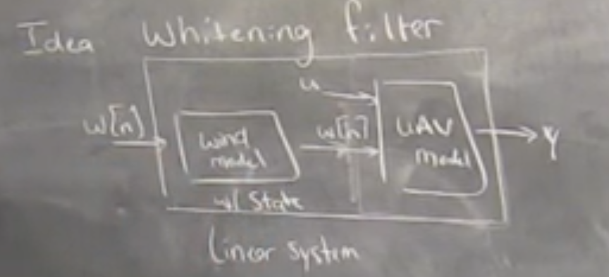

# Stochastic / Robust Control

## 7:00

Sound turns on

## 8:30

Big Idea's of "How do we quantify performance?"

1. Expected Cost
2. Worst-case Analysis
3. Chance constraints (prob of vi constraints)
4. Gain Bounds
5. Regret bounds

## 14:00

Exampected cost
- Monty Carlo: Average a bunch of runs.
- DP still works.
    - Can be arbitraily rich dynamics after passing gausian noise through nonlinaer dynamics

## 21:30 

Stocastic LQR (H2)

$x[n+1]=Ax[n]+Bu[n]+w[n]$

$w[n]$ is mean-zero, Guassian iid

> Note: This is not LQG. LQG is Stocastic LQR + Kalman

1. Noise and controler come into equilibrium
2. Cost becomes unbounded. Const continues to accure.
- RL will discount costs or average costs
3. Cost still has a beautiful form

$J^*_n(x)=x[n]^TS[n]x[n]+c_n$
- Quadratic form + constant
- Quadratic form is the same as LQR
- Constant will grow to $\infin$

## 30:00 

Derivation

"Deterministic LQR K is the solution to the stochastic LQR"
- Not true for nonlinear systems.
- Cannot separate estimation and control in general (but people do).

## 37:00

Ex: UAV in the wind

Finding a power line to purch on via magnetomitor and tracking 2 - pole pair magnetic field.

Wind gusts cause issues
- RY-81000 ultrasonic anemometer (measure air noise)
- Wind is not gaussian iid noise

Whitening filter
- Random white noise -> Wind model (with state) -> wind noise -> System dynamics
- Wind model acts like a low-pass filter and "colors" the white noise
- Can't run LQR on just the UAV (because noise input isn't gaussian iid)
- Can run LQR on UAV + Wind model

## 46:00

>
    Guaranteed Margins for LQG Regulators
    JOHN C DOYLE
    Abstract - There are none.

## 48:00

Worse-case analysis

- Solve the problem but oponent has all information and give you the worst value at every point in time.

Lyaponav
Tube MPC

## 56:00

Gain Bounds

Ratio of state to noise?
- L2 gain bound
- Small gain theorum
- $H_\infin$ control design is "just" finding K to minimize the $L_2$ gain
- extra term in LQR