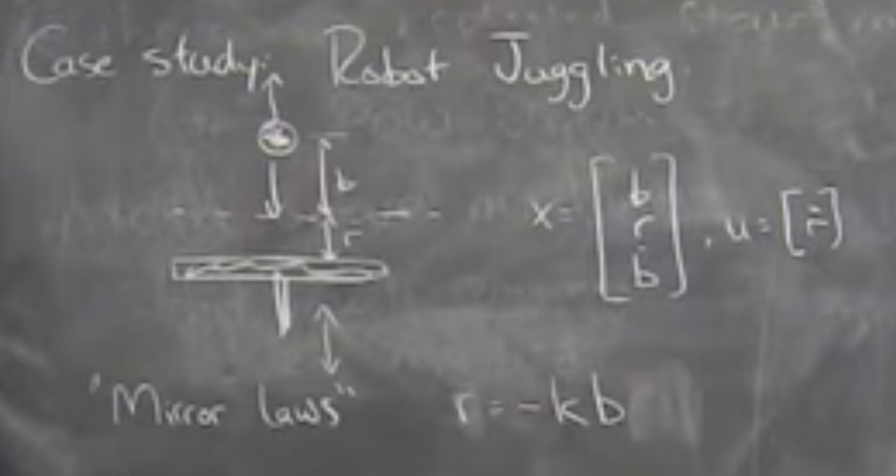
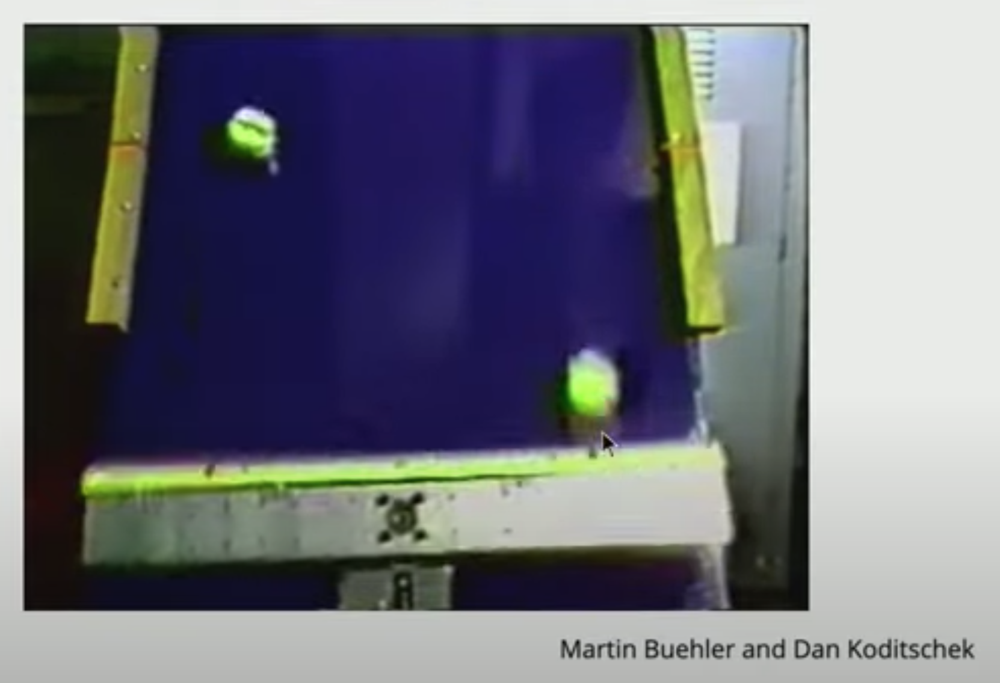
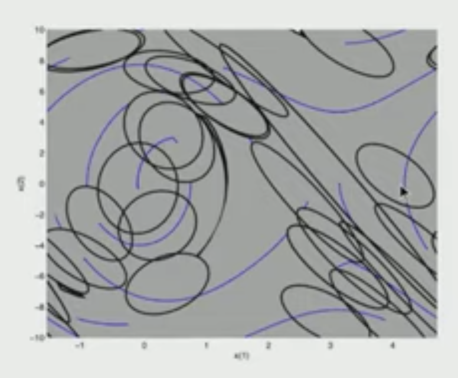
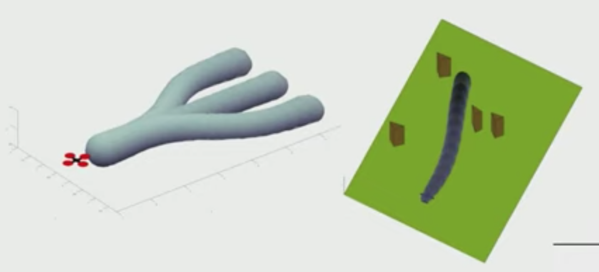

# Feedback Motion Planning

Course talked as if there's two aproaches:
- Feedback Controllers
- Trajectory Planning

Is there any real difference between a plan and a policy? Just semantics or is there more too it?

For example, MPC kind of blurred the lines. In MPC, the plan is the policy.

However, that distinction is meaningful. Somewhat of a philisophical debate.

Policy (explicit)
- $u = \pi(x)$
- implies you've solved for all x.
- Pro: you can talk about robustness
- Con: hard to scale for large / complex systems

Plan (implicit)
- $u = $ result of some computation
- Pro: scales better. 
    - Possible to only know the current state and will figure out what to do "on the fly"

On the policy side of the extreme, thinking about walking around, you probably have an explicit map in your head that's almost reflex like. When you do things often, you don't have to think about it.

On the planning extreme, Other things you do in life feel like a plan. For example planning a vacation, going to some exotic place you've never been before. You probably don't have an explicit policy of everything you're going to do in order. It's something you've never done, might never do again, and if there's another vacation, you'd have to reason it out differently.

The interesting part is in the middle. How far can I get with a pre computed policy like walking? vs do I do planning on the fly for legged locomotion.

Interface between planning and control is important, interesting, and subtule. 

The ability to do online stuff you've never done is important. However, the way we've talked about planning so far, is somewhat limited: either I have a big feedback controler or I have trajectories. It doesn't have to be either or. There are nice ways to combine the two

## 11:00 Feedback Motion Planning

From plans to policies:
- MPC
- Explicit MPC
- RRT* (sample based motion planning )
    - backwards from the goal
    - trends towards a policy
- Guided policy search
    - run a planner many times
    - train NN to store output of plans

From policies to plans:
- Motion primitives
    - Solution when no obsticles guides solution when there are obsticales
- Alpha Zero
    - Learning a policy
    - Every step it does rollouts guided by the policy
    - Uses those plans to refine the policy
- Feedback Motion Planning
    - Plan to run a controller for a little while 
    - Switch to a different controller for a little while
    - Toolbox of controllers (possibly parameterized)
    - Decide to compose my controllers into a more complicated sequence than I had previously computed.
    - Get some of the benefits of feedback control (robustness, etc)
    - Have some of the compositionality and novelty that you can get out of a planning framework.

## 18:00 Case Study: Robot Juggling

Simplest model: One ball in y-axis

Designed "Mirror" Controllers
- Padle does the oposite as the ball
- Contact is always at the same location
- Simplifies a lot of states
- Policy becomes very simple

Then, fancier juggling (x and y plane)
- don't want to throw away the basic controller
- almost exactly the same controller works

In 3D, they could do palming, catching, etc.
- All, slight variations of the "mirror law" policy

How do you compose all the controllers together?

Paper: Sequential Composition of Dynamically Dexterous Robot Behaviors

- Think of a controller as a funnel
- I can compose multiple controllers as long as the output of one funnel lands at the input of the next funnel.
- Sequential composition of multiple feedback controllers through funnel like thinking.
    - On spot: one good controller for walking, one for trotting, one for sprinting, one for dancing, etc.

## 32:00 How to combind controllers

Pedulum example
- LQR around unstable fixed point
- Trajectory optimization for swing up.
- If I initialize in a state that already has a controller, I'm good.
- If I initialze in a state I don't have a controller in yet, new trajectory optimization to get to any state with a controller
- As samples go to infinity, probablistic feedback coverage
- Result is a sparse tree of controllers.
- Algorithm: LQR Trees 

## 46:00 Cart pole video

## 49:00 Feedback Motion Planning Online

Standard idea for online planning with dynamic vehicles
- "Trajectory Library"
    - Fly straight manuver
    - Band left 10 degrees manuver
    - Bank right 10 degrees manuver 
    - etc. 
    - Tree of possible executions

## 56:00 Philosophy: Composition matters

- Combinatorial generalization
- Relatively small library of controlelrs
- Ability to put them together in novel ways

## 1:01:00 Course Wrap Up

1. Simple Model Systems
2. Dynamic Programming / Optimal control
3. Lyaponav Theory
4. Trajectory Optimization
5. Policy Search

6. Hybrid Systems
7. Planning and control through contact

8. High DOF / Complex Obsticals / Constraints
9. Centroidal Dynamics
10. Sample based motion planning

11. Stochastic / Robust control
12. Output Feedback
13. Feedback motion planning

Frontiers of dynamics and controls
- Best time ever to be working on this stuff 
- State representation
    - Approximate models
    - Reduced models
    - Intutive Physics (wrong but good enough for control)
    - Output feedback (even though we know some problems are NP hard)
    - What's the state of my shirt?
    - What's the state of the pasta?
- Control from cameras
    - CV went through it's revolution
    - What's the right way from RGB image into something that I can reason about in a modeling, planning, or feedback control sense.
    - Huge deal because cameras open up the diversity of the world. It's not a cart pole on a track with 3 states
    - The "state" is San Fransisco and anything can happen? How do you do robust control on San Fransisco?
- Distributions / reason about robustness over "open worlds" ("open domains")
    - how acurate does this need to be?
    - build the matrix?
- Machine learning + control
    - New problem formulations
    - New mathematical tools
    - New smart people
    - Connecting data
    - Historically, controls has been "I want an algorithm that works for all linear systems". This is a huge ask that drives a lot of complexity.
    - Instead, restrict problem to realistic things. What things could actually experience 
- Big data comes to controls
    - Fleet learning
    - Does this change how you make controllers?
    - Is there data sharing that'd improve things?
    - How do I adapt to different distributions?
