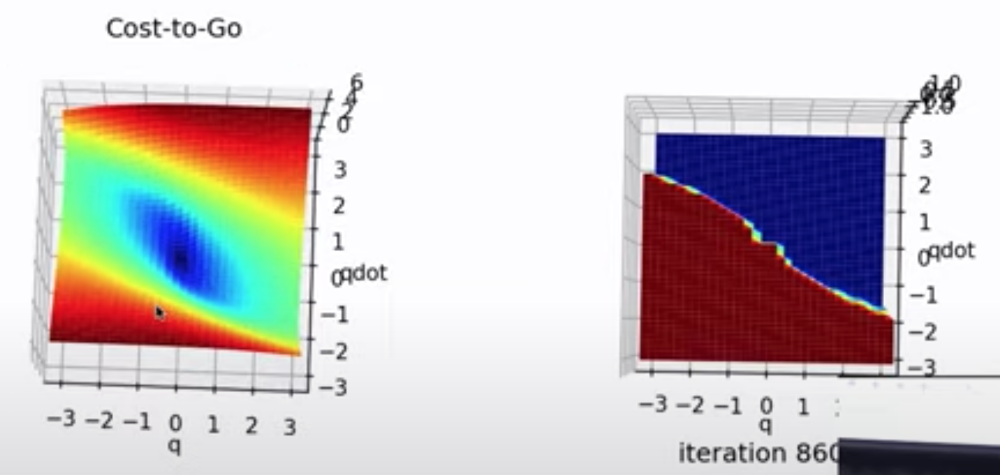

# Dynamic Programing

First 20 minutes incomplete. Watch S2021 for episode 3.

- Control as an optimization problem
- Ex) Double Integrator
- Numerical DP
- Intuition about Value Functions
- Ex) DP for the pendulum

The world gives you a vector field (phase diagram). Our job is not to erase it and start over but to modify it as little as possible.

Starting with pendulum,

$ml^2\ddot\theta+b\dot\theta+mglsin(\theta)=u$

What about feedback linearization.

$u = 2mglsin(\theta)$

This controller "inverts" gravity. With this controller, some of the vector field had to change significantly (which requires significant control effort)


Peak torque required would be $2mgl$. If I don't have that, maybe the control is 

$u = sat(2mglsin(\theta),-1,1)$

(i.e. the arm tries to swing up on one side and gets stuck)

Key Idea: Control as Optimization
---------------------------------

Given a trajectory $x(.), u(.)$ where $x(.)$ is $x(t)$ for $t\epsilon[0,t_{max}]$

Assign a score (single scalar number)
- RL calls this the reward and gives positive reinforcement.
- Controls calls this the cost and penelizes.
- RL used to be called "Approximate Dynamic Programming"

Example Costs:
- Time to goal
- Average distance over trajectory

Example Constraints:
- $|u|<1$
- $x(t_f)=x_{goal}$

[19:00]
Example: Minimum time for double Inegrator

Box of mass 1 and no damping trying to linearly move forward with limited actuation.

$\ddot{q}=u$, $|u|<1$

"Bang-Bang" (always run saturated is optimal)
- Find the "policy" aka control
- Minimum Time policy for double integrator
- Whereever the initial condition is, full actuation until ending up on the "backwards s" and then ride it into the stable fixed point of double integrator.
- The only time you overshoot is when staring in an initial condition where it's not possible to stop in time.


~29:00
Minimum-time problems are like shortest path in CS.
- Directed (weighted) graph search
- Discretize phase diagram into a grid.


This problem is solved via Dynamic Programming

Discrete Dynamic Programming
----------------------------


DP is a recursive algorithm
- Solves backwards from the goal

$J(s_i) = min_{a[*]}\Sigma_{n=0}^{\infty}g(s[n],a[n])$ 
- "Cost to Go" (aka "Value function" in RL)
- Function of state.
    - For every node, I can compute the cost.
    - Cost is computed via "If I pick the best action possible (optimal policy), J is the cost to get to the goal"
- Issues: 
    - Watch for convergence when summing to $\infty$
    - $a[*]$ (all posible actions) is a hard thing to search over
        - posibly infinet list of discitions to be made.

Big idea of Dynamic Programming is that we can do better than this.
- Key observation is that there is an additive cost structure. 
    - Not allowed to have cost function $g(s[n],a[n])$ be a function of more than one state $s[n]$
- an easier, equivalent problem can be written in a recursive form.
 
$J(s_i) = min_{a}[g(s,a)+J(f(s,a))]$ 

"Cost of state $i$ is the cost of taking one step + the cost to go of the next step"
- Looking back at first equation, this new equation is just pulling the first $n=0$ out and adding the rest of the sum $n=1$ to $\infty$.
- Condition to certify optimality
    - What's amazing is that it's also an algorithm that's used to find the optimal controller
    - Discrete Belman Equation
    - Why not something faster like Dykstra?
        - Goal is to compute policy from all possible initial conditions (Belman) which is different from starting from a single initial condition and solving forward/backwards to goal (Dykstra). Dynamic Programming solves the whole thing simultaneously and has exact corralation to continuous time formulation.


- Initialize J with best guess
- Iteratively update J.
- J converges to optimal J (plus a constant offset)

"Cost to go" is one of the most fundamental ideas in controls. If you can find a cost to go function, you've found something that "tells you how to act".
- Connections to Lyaponav functions
- Extentions called "Disopation Inequalities" that talk about robust control.
- Make bounds on uncertainties.

Example 1: Tabular RL


- Optimal action is often not unique.
- Optimal cost to go is unqiue.
- Optimal cost to go + constant: Absolute value is incorrect but optimal policy is still correct.
- Don't have to update every state on every iteration. If you only have some information, you can update with that and as long as you visit each state with some probability, the algorithm will converge.

Example 2: Double Integrator Dynamic Programming Sim


Example 3: Using different cost functions.
Min: x^2+u^2 
- (penalize being away from goal and hard actions)
- Quadratic Regulator
- Softer policy


- If you have no cost on action but you have limits on action, in general, the optimal policty will be bang-bang. Switching between the two becomes fairly complicated depending on dynamics.

[1:12:00] Issues:
- Quantization can cause issues. Small errors near the goal build up and cause very wrong answers away from the goal.
    - Bang Bang is the worst because if you're slightly off, you take exactly the wrong option.
- Scalability: Only works if you can make a fine enough mesh over state-space. Dimensions ~5-6. Curse of dimensionality.
    - On the flip side, if you find a low dimensional system (of arbitrary complexity) 
    - Can tell everything about a system via graphical analysis if it's on a line.

    ```
    HUGE!!! READ THIS AGAIN.

    Limits of where we can do optimal control: 

    Low dimensional, arbitrarily complex (trig, discontinuities, actuator limits, etc.) can be solved via value iteration.

    Arbitrary dimension but linear, we can solve optimal control problems very well.

    Most interesting things are high dimensional and non-linear. Grow from ability to solve things at the extremes to everything in the middle.
    ```
- Model is known
    - Will be able to handle model uncertainties (i.e. friction) via stocastic optimal control.
- Cost function
    - "Don't know how to make salad or ties shoes"
- Assumes "Full State Feedback"
    - To execute controller, need to know what state I'm in.
    - Very few "partially observable" versions of these problems.

"If you can write an additive cost function, Dynamic Programming is the crux of control."
- Taking short term costs and spreading them out over long term costs.
- If I find a "cost to go" function, all I have to do is go downhill on my cost to go function. Fundamental concept.

