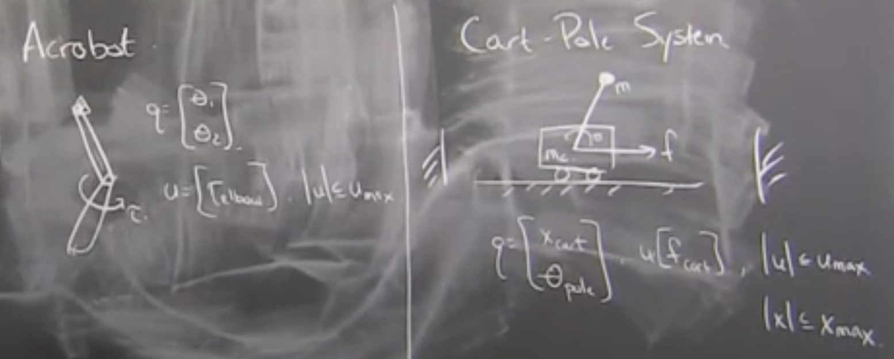
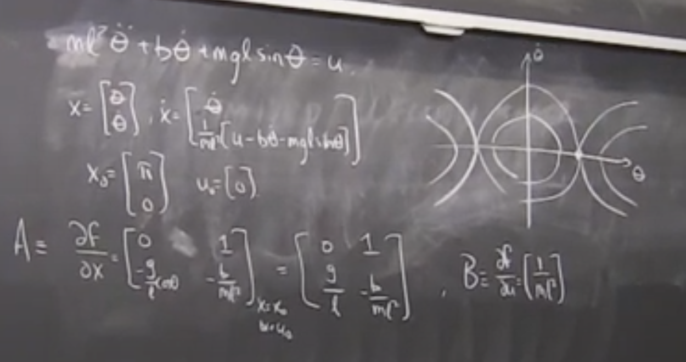
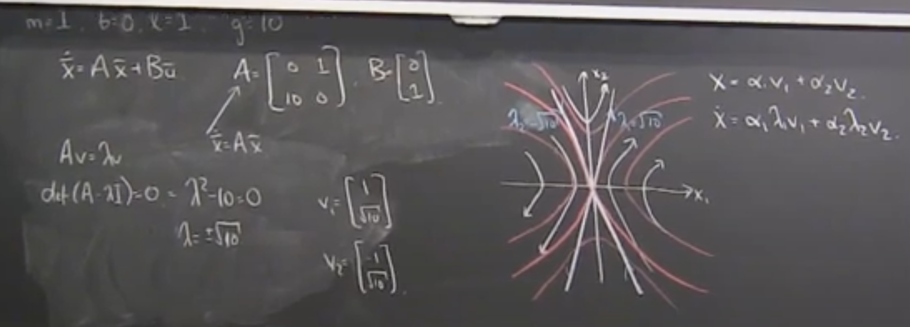
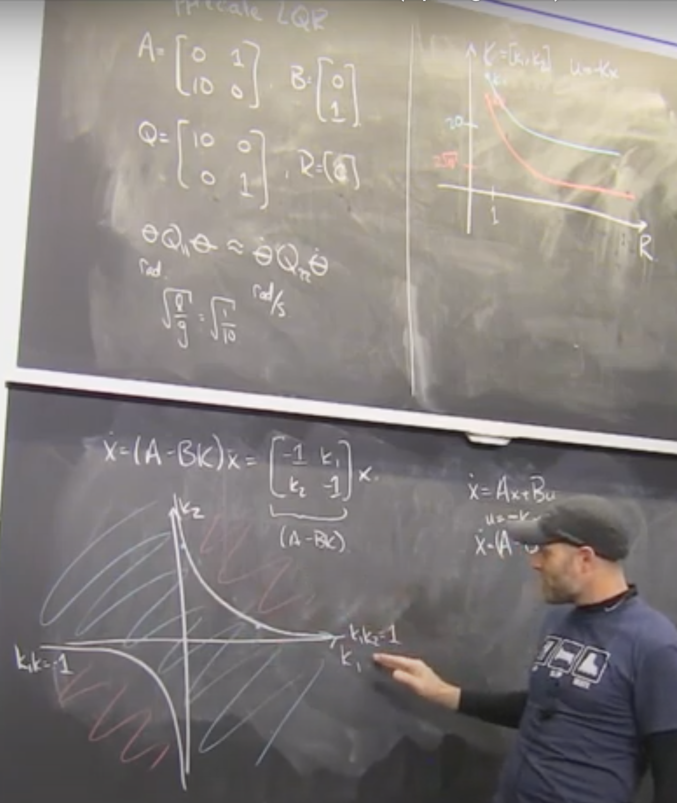

# Acrobots, Cartpoles, and Quadrotors

- More interesting systems
- Use algorithms we already have
- Introduce new algorithms only to solve new problems we can't.

$M(\dot{q})\ddot{q}+C(q,\dot{q})\dot{q} = T_g(q) + Bu$

Acrobot: $B = [0;1]^T$

Cart-pole: $B = [1;0]^T$

Acrobot
-------

Goal: Swing up and balance

$l(x,u) = (x-x_{up})^TQ(x-x_{up})+u^TRu$

Value Iteration? Yes, but...

LQR? Great for balance, doesn't work for swing up.

LQR for non-linear system

Need to convert $\dot{x}=f(x,u)$ into $\dot{x}=Ax+Bu$

Around a linearization point $(x_0,u_0)$, do a first-order taylor series approximation.

$\dot{x}\approx f(x_0,u_0)+\frac{\partial f}{\partial x}|_{x_0,u_0}(x-x_0)+\frac{\partial f}{\partial u}|_{x_0,u_0}(u-u_0)  $

$\dot x = \dot x_0+A(x-x_0)+B(u-u_0)$

$\dot x- \dot x_0 =+A(x-x_0)+B(u-u_0)$

Linear Transformation: 
- $\bar x = x-x_0$
- $\dot{\bar{x}} = \dot{x}-\dot{x}_0$
- $\bar u = u-u_0$
- Note: today, $\dot{x}_0 =0$ (else "moving" nominal point)

$\dot{\bar{x}} = A\bar{x}+B\bar{u}$

Example: Linearized Pendulum

[26:30] Plot phase diagram of linear system

Linearized approximations can be *very* good (locally)

[35:00-47:00] Appriciating / Visualizing / Understanding LQR

Linearizing the manipulator equations
-------------------------------------

In general, 

$M(q)\ddot{q}+C(q,\dot{q})\dot{q} = T_g(q) + B_mu$

$x = [q;\dot{q}]^T$

$\dot{x} = [\dot{q};M^{-1}(q)[B_mu+T_g(q)-C(q,\dot{q})\dot{q}$

$A \equiv \frac{\partial f}{\partial x}= [0 I; -M^{-1} \frac{\partial T_g}{\partial q} -M^{-1}C$

$B \equiv [0;M^{-1}B_m]$

[53:00] Code examples